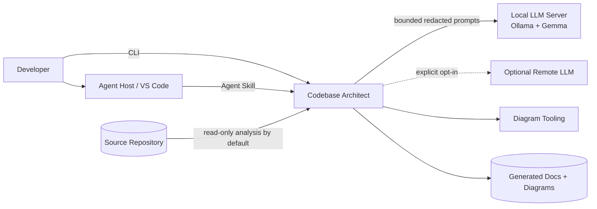
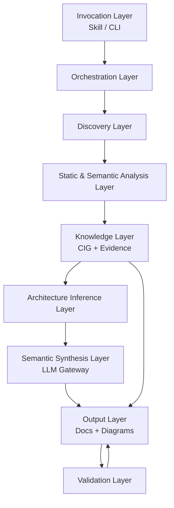
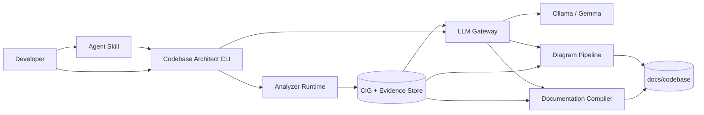
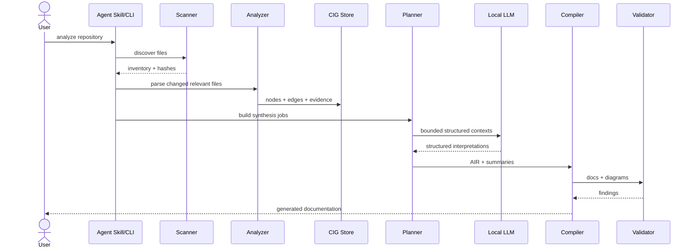
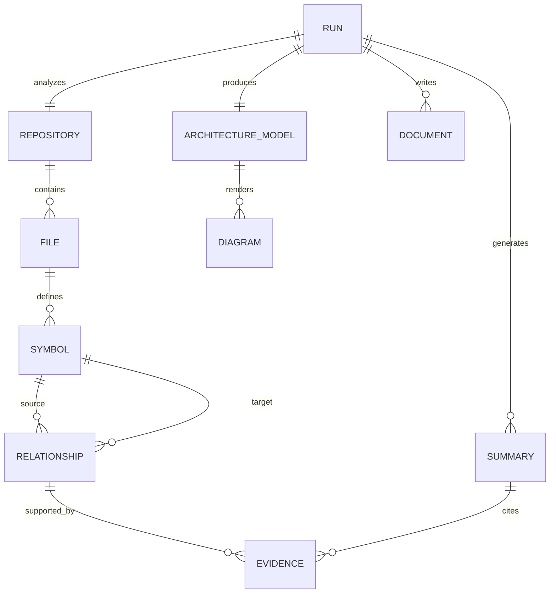
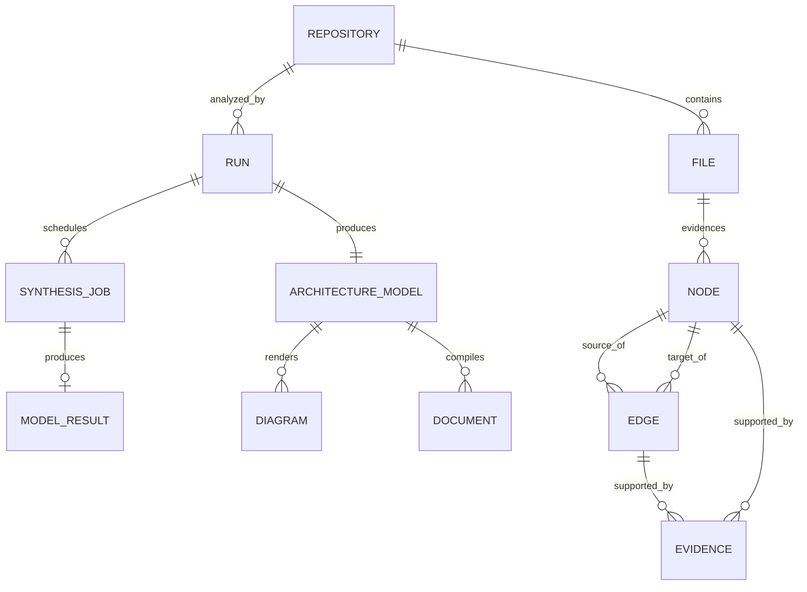
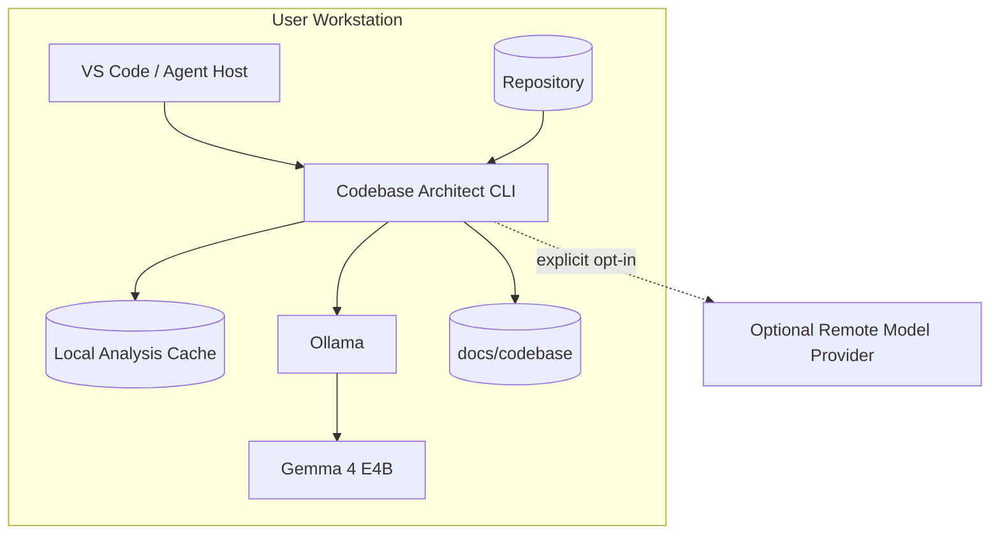
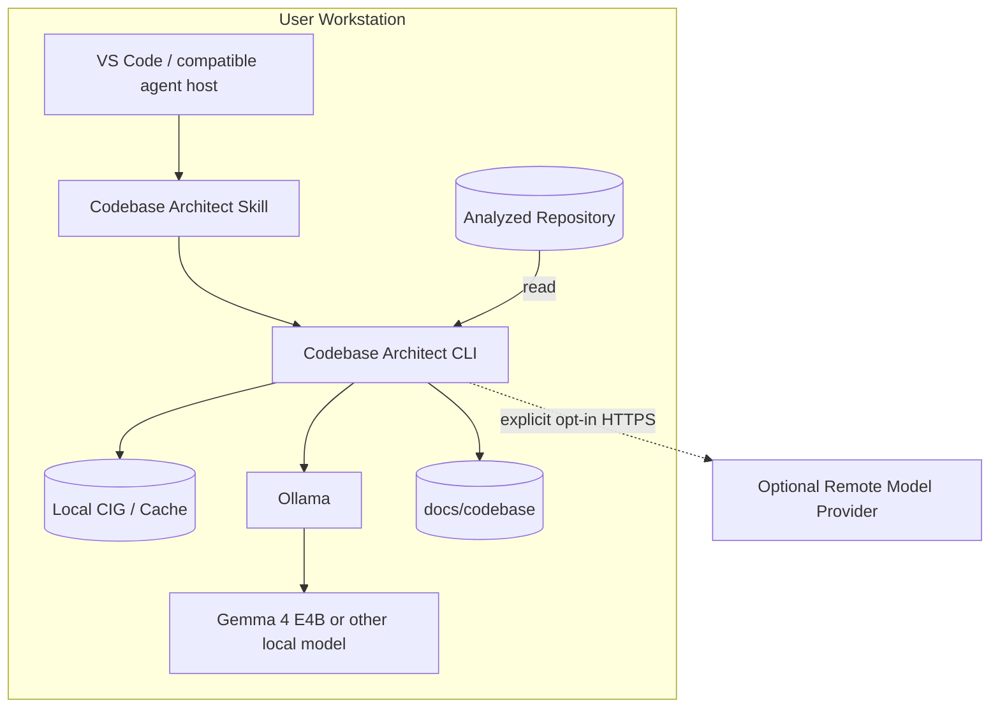

# Deep Technical Architecture & Engineering Documentation

> **Document type:** Master Technical Architecture / Engineering Design Document  
> **Documentation model:** Docs-as-Code  
> **Recommended filename:** `DEEP_TECHNICAL_ARCHITECTURE.md`  
> **Status:** Draft  
> **System:** Codebase Architect  
> **Project:** Codebase Architect Open-Source Agent Skill & CLI  
> **Document version:** 0.3.0  
> **System version:** 0.1.0-planned  
> **Last updated:** 2026-09-07  
> **Primary owner:** TBD — initial maintainer / future open-source maintainer group  
> **Technical owner:** TBD — initial maintainer / architecture maintainers  
> **Security owner:** TBD — security maintainer role not yet assigned  
> **Operations owner:** TBD — release/operations maintainer role not yet assigned  

---

# How to Use This Document

This document is the authoritative **target architecture and engineering design** for Codebase Architect.

The repository has not yet been implemented. Therefore:

- statements describing intended structure are marked as target architecture;
- implementation-specific facts remain `TBD` until source code exists;
- no performance, security, reliability, or compatibility claim in this document should be interpreted as measured implementation evidence unless explicitly marked `[EVIDENCE]`;
- when implementation begins, this document MUST be continuously reconciled against source code, tests, release artifacts, and generated architecture evidence.

The product is an open-source, local-first codebase intelligence system that can be invoked from an Agent Skills-compatible coding environment or directly from a CLI. It scans a software repository, extracts deterministic facts, constructs a code-intelligence graph, uses an optional local or remote LLM to synthesize higher-level explanations, generates engineering documentation, and renders multiple synchronized architecture views.

The primary design objective is not "generate a README." It is:

> Turn a software repository into a traceable engineering handbook whose important claims can be tied back to code, configuration, infrastructure, tests, schemas, or other machine-readable evidence.

The system MUST distinguish facts from inference and MUST not fill unknown sections with fabricated content.

---

# Documentation Markers

| Marker | Meaning |
|---|---|
| `[REQUIRED]` | Expected for nearly every production implementation |
| `[CONDITIONAL]` | Include when applicable |
| `[EVIDENCE]` | Requires measurable or independently verifiable evidence |
| `[OWNER]` | Requires an accountable team/person |
| `[DECISION]` | Architectural decision or trade-off |
| `[RISK]` | Identified technical/business/security risk |
| `[TBD]` | Information is genuinely not yet known |
| `[N/A]` | Section deliberately does not apply |
| `[TARGET]` | Proposed architecture not yet implemented |
| `[VERIFIED]` | Derived from deterministic repository evidence |
| `[INFERRED]` | Derived by rules or model interpretation and not fully proven |

---

# Documentation Rules

1. Generated documentation MUST describe implementation, not model assumptions.
2. Every claim produced by Codebase Architect MUST carry an internal provenance class:
   - `VERIFIED`
   - `INFERRED`
   - `UNKNOWN`
3. Important generated claims SHOULD include source evidence such as:
   - file path;
   - symbol;
   - line range where stable;
   - configuration key;
   - manifest entry;
   - infrastructure resource;
   - test;
   - schema;
   - commit SHA.
4. Secret values MUST never be copied into generated documentation or model prompts.
5. Generated diagrams MUST originate from the same normalized architecture graph so that diagram styles do not contradict each other.
6. LLM output MUST NOT be treated as source-of-truth repository analysis.
7. Deterministic static analysis MUST be preferred wherever practical.
8. Large repositories MUST be processed hierarchically and incrementally; the system MUST NOT depend on fitting the full repository into one model context window.
9. Generated documentation SHOULD be reproducible given:
   - the same repository commit;
   - the same analyzer version;
   - the same configuration;
   - the same model and generation parameters, acknowledging that model nondeterminism may still affect prose.
10. No production credentials, access tokens, private keys, API keys, cookies, customer records, or secret environment values may be included in output artifacts.

---

# 0. Document Governance

## 0.1 Document Identity `[REQUIRED]`

| Field | Value |
|---|---|
| Document ID | `CBA-ARCH-001` |
| Project | Codebase Architect Open-Source Agent Skill & CLI |
| System | Codebase Architect |
| Repository | `TBD — public repository has not yet been created` |
| Document version | `0.3.0` |
| System version | `0.1.0-planned` |
| Status | Draft |
| Classification | Public |
| Created | 2026-09-07 |
| Updated | 2026-09-07 |

---

## 0.2 Document Purpose `[REQUIRED]`

This document defines the proposed architecture, boundaries, data model, processing pipeline, local-AI integration, security model, documentation pipeline, diagram pipeline, reliability strategy, test strategy, release model, and open engineering decisions for Codebase Architect.

It is intended to become the canonical architectural reference for maintainers and contributors.

### Questions This Document Must Answer

- How can the project understand a repository larger than a model context window?
- Which facts are extracted deterministically and which are inferred?
- How is repository evidence represented?
- How does the local Gemma model participate without becoming the source of truth?
- How does the Agent Skill invoke the analysis engine?
- Can the CLI work independently of VS Code or GitHub Copilot?
- How are multiple diagrams generated from one architecture model?
- How are secrets and untrusted repository contents handled?
- How are incremental updates computed?
- How can contributors add language/framework analyzers?
- How are generated claims validated and traced back to source?
- How can the project remain fully local?

---

## 0.3 Intended Audience `[REQUIRED]`

| Audience | Why They Need This Document |
|---|---|
| Core maintainers | Product architecture and implementation boundaries |
| Contributors | Extension points, contracts, repository structure |
| Agent-skill users | Understand execution and generated outputs |
| Security reviewers | Threat model, secret handling, tool execution |
| Local-AI users | Model integration and privacy boundaries |
| Language-adapter authors | Parser and semantic-index interfaces |
| Diagram-renderer authors | Architecture IR and renderer contracts |
| Release maintainers | CI/CD, packaging, compatibility |
| Enterprise adopters | Architecture, evidence, privacy, reproducibility |

---

## 0.4 Ownership `[OWNER]`

| Area | Owner |
|---|---|
| Product | TBD — initial maintainer |
| Architecture | TBD — core maintainers |
| CLI | TBD |
| Analyzer framework | TBD |
| Language adapters | TBD per adapter |
| LLM integration | TBD |
| Documentation generation | TBD |
| Diagram generation | TBD |
| Security | TBD |
| Release engineering | TBD |
| Documentation | TBD |

---

## 0.5 Review and Approval

| Role | Name/Team | Status | Date |
|---|---|---|---|
| Author | Initial maintainer | Draft | 2026-09-07 |
| Architecture reviewer | TBD | Pending | TBD |
| Security reviewer | TBD | Pending | TBD |
| Operations reviewer | TBD | Pending | TBD |
| Approver | TBD | Pending | TBD |

---

## 0.6 Revision History

| Version | Date | Author | Description |
|---|---|---|---|
| 0.1.0 | 2026-09-07 | Initial maintainer | Initial target architecture |
| 0.2.0 | 2026-09-07 | Initial maintainer | Full template-compliance audit; restored omitted subsections and explicit N/A/TBD contracts |
| 0.3.0 | 2026-09-07 | Initial maintainer | Final integrity pass; removed duplicate subsection numbering and verified Markdown structure |

---

# 1. Executive Technical Overview

## 1.1 System Summary `[REQUIRED]`

Codebase Architect is a local-first open-source developer tool that analyzes an existing software repository and generates a structured engineering documentation package plus multiple architecture diagrams.

The system is intentionally split into two classes of intelligence. **Deterministic code intelligence** extracts repository structure, symbols, imports, calls, routes, schemas, configuration references, infrastructure resources, tests, queues, jobs, and dependency relationships. **Semantic intelligence** uses an LLM to explain the extracted facts, classify patterns, summarize modules, describe workflows, identify likely architectural intent, and write human-readable documentation.

The LLM is not permitted to replace parsing. A 4B-class local model such as Gemma 4 E4B can therefore be used without requiring the model to memorize or reason over an entire large repository in one prompt. The model receives bounded, structured slices of the repository graph and supporting evidence.

The system's core internal representation is the **Code Intelligence Graph (CIG)**. Nodes represent repositories, packages, files, symbols, APIs, databases, tables, events, queues, jobs, external systems, configuration keys, infrastructure resources, tests, and other technical elements. Edges represent relationships such as `IMPORTS`, `CALLS`, `EXPOSES`, `READS`, `WRITES`, `PUBLISHES`, `CONSUMES`, `DEPENDS_ON`, `DEPLOYED_AS`, and `TESTED_BY`.

Architecture inference operates over the CIG and produces a normalized **Architecture Intermediate Representation (AIR)**. AIR describes systems, containers, components, actors, datastores, integration boundaries, trust boundaries, workflows, deployment units, and evidence. All diagram renderers consume AIR rather than separately asking an LLM to invent diagrams.

The first supported execution modes are intended to be:
1. Agent Skill invocation from VS Code/Copilot-compatible environments.
2. Direct local CLI invocation.
3. Programmatic library invocation in a future release.

The intended default privacy mode is fully local. Repository contents, extracted graph data, prompts, model output, and generated documentation remain on the local machine when a local LLM provider is selected. Remote model providers may be supported later, but must be explicit opt-in configuration.

The generated output is docs-as-code. It is written to a configurable directory, defaults to `docs/codebase/`, and includes a master architecture document, module/component documentation, evidence indexes, ADR candidates, technical diagrams, simplified visual diagrams, data-flow diagrams, and machine-readable analysis artifacts.

The project is designed to support large monorepos through hierarchical analysis, caching, hash-based incremental invalidation, graph traversal, model-context budgeting, and selective source reopening. Full-repository prompt stuffing is explicitly rejected.

### Current vs Target Architecture

**Current implemented state:** No production repository implementation has been provided in this conversation. This document therefore MUST NOT present proposed modules as already deployed software.

**Target state:** The component, graph, evidence, provider, documentation, diagram, validation, and incremental-analysis architecture described below is the implementation target.

Once source code exists, future revisions MUST replace design assumptions with repository evidence and add `[EVIDENCE]` references.

---

## 1.2 One-Minute Architecture

**Codebase Architect** is a local-first repository intelligence and documentation generator for developers, engineering teams, maintainers, and people evaluating unfamiliar software systems.

### Primary Architectural Components

1. Agent Skill Adapter
2. CLI / Orchestrator
3. Repository Scanner
4. Language & Framework Analyzer Layer
5. Code Intelligence Graph Builder
6. Evidence Store
7. Architecture Inference Engine
8. LLM Gateway
9. Documentation Compiler
10. Diagram Rendering Pipeline
11. Validation & Traceability Engine

### Primary Processing Flow

```text
Repository
   ↓
Repository Scanner
   ↓
Language / Framework Analyzers
   ↓
Code Intelligence Graph
   ↓
Architecture Inference
   ↓
Analysis Planner
   ↓
Local/Remote LLM Synthesis
   ↓
Architecture IR + Documentation Model
   ↓
Documentation Compiler + Diagram Renderers
   ↓
Validation / Evidence Checks
   ↓
docs/codebase/
```

The repository remains the ultimate source of truth.

---

## 1.3 Architecture at a Glance

| Dimension | Target Implementation |
|---|---|
| Architecture style | Modular CLI application with plugin/adaptor architecture |
| Primary implementation language | Python 3.12+ proposed |
| Secondary parsing/runtime integrations | TypeScript compiler tooling, Python AST, Tree-sitter |
| Frontend | N/A for MVP; optional VS Code extension later |
| Backend/server | N/A for MVP; local process |
| Metadata store | SQLite + JSON artifacts |
| Graph representation | In-memory typed graph persisted as normalized JSON/SQLite |
| Cache | Local content-addressed cache |
| Messaging | N/A for MVP |
| Cloud/platform | None required |
| Deployment | Local package / GitHub skill / optional standalone executable |
| Authentication | None for local process |
| Authorization | OS filesystem permissions |
| AI provider | Provider adapter; Ollama local default |
| Local model target | Gemma 4 E4B or compatible local instruction model |
| CI/CD | GitHub Actions proposed |
| Observability | Structured local logs + optional trace/debug artifacts |
| Diagram formats | Mermaid, Graphviz, D2; SVG/HTML visual renderer planned |

---

# 2. Problem, Goals, Scope, and Constraints

## 2.1 Problem Statement `[REQUIRED]`

Large codebases are difficult to understand because knowledge is distributed across source code, configuration, infrastructure, tests, schemas, package manifests, deployment definitions, and tribal knowledge. Existing AI documentation generators often rely on shallow file summarization or large prompts. That approach produces incomplete or fabricated architectural conclusions and degrades severely on repositories larger than the model context window.

The project addresses four concrete problems:

1. **Repository comprehension:** determine how the code is actually structured and connected.
2. **Evidence-backed documentation:** generate prose that can be traced back to implementation.
3. **Architecture visualization:** generate multiple synchronized views for different audiences.
4. **Local operation:** support users who cannot or do not want to send proprietary code to hosted AI services.

### Why the Problem Matters

- New engineers can spend days or weeks mapping unfamiliar systems.
- Architecture documentation rapidly becomes stale when maintained manually.
- Security and operational knowledge is often fragmented.
- Small teams lack dedicated technical writers or architects.
- Hosted code-analysis tools may be unacceptable for private, regulated, or air-gapped repositories.
- Small local models cannot reliably infer an entire codebase if forced to operate without deterministic preprocessing.

---

## 2.2 Business Goals

| ID | Goal | Success Metric | Owner |
|---|---|---|---|
| BG-001 | Make deep codebase documentation accessible to any developer | One-command generation for supported repositories | TBD |
| BG-002 | Preserve local privacy | Fully offline execution possible after dependencies/models are installed | TBD |
| BG-003 | Support open-source extensibility | Public analyzer and renderer interfaces with contributor documentation | TBD |
| BG-004 | Produce useful onboarding documentation | New-user evaluation demonstrates substantially faster architecture discovery | TBD |
| BG-005 | Avoid AI-only hallucinated architecture | Critical generated claims expose provenance/confidence | TBD |

---

## 2.3 Technical Goals

| ID | Goal | Measurement |
|---|---|---|
| TG-001 | Deterministic-first analysis | ≥90% of structural relationships in supported language fixtures extracted without LLM use |
| TG-002 | Large-repository operation | Analyze repositories substantially larger than model context through hierarchical processing |
| TG-003 | Traceability | 100% of high-confidence architecture claims carry at least one evidence reference |
| TG-004 | Local model support | Ollama-compatible local inference without cloud dependency |
| TG-005 | Incremental regeneration | Unchanged files are not reparsed after a compatible prior analysis |
| TG-006 | Diagram consistency | All standard diagrams render from a shared AIR |
| TG-007 | Extensibility | New analyzer/renderer implemented without modifying orchestration core |
| TG-008 | Safe repository handling | Detected secrets are redacted before LLM submission and generated docs |
| TG-009 | Reproducible metadata | Analysis artifacts include repository commit and analyzer versions |

---

## 2.4 Non-Goals `[REQUIRED]`

- Compile or execute arbitrary user application code by default.
- Prove full runtime behavior through static analysis alone.
- Replace security review, threat modeling, SRE testing, or performance benchmarking.
- Guarantee perfect whole-program call graphs for dynamic languages.
- Automatically claim standards or regulatory compliance.
- Require GitHub Copilot.
- Require internet connectivity.
- Store or host user repositories.
- Become a general-purpose IDE assistant in the MVP.
- Modify the analyzed application code unless explicitly requested by a future feature.

---

## 2.5 In Scope

- Git repositories and ordinary filesystem repositories.
- TypeScript/JavaScript/Python initial language support.
- Repository/file/package/symbol indexing.
- Import/dependency analysis.
- Common route/framework detection.
- Database/schema/configuration discovery.
- GitHub Actions/Docker/IaC discovery.
- Call/data-flow approximation with explicit confidence.
- Local model integration.
- Documentation generation.
- Mermaid/Graphviz/D2 architecture output.
- Evidence links.
- Incremental analysis.
- Agent Skill packaging.
- Direct CLI.

---

## 2.6 Out of Scope

- Perfect runtime tracing.
- Binary reverse engineering.
- IDE GUI.
- SaaS hosting.
- Distributed collaborative analysis service.
- Automatic production access.
- Dynamic instrumentation of arbitrary applications.
- Every programming language.
- Guaranteed data lineage across opaque external systems.
- Automatic compliance certification.
- Automated cloud deployment.

---

## 2.7 Assumptions

| ID | Assumption | Impact if False | Owner | Status |
|---|---|---|---|---|
| ASM-001 | Repository source is locally readable | Analysis cannot run | Core | Proposed |
| ASM-002 | Most architecture-relevant structure is statically discoverable or inferable | Documentation quality falls | Analyzer | Proposed |
| ASM-003 | Git is commonly available | Incremental change detection needs fallback hashing | CLI | Proposed |
| ASM-004 | Local users can run Ollama or another compatible inference server when AI synthesis is desired | LLM features unavailable; deterministic reports still possible | LLM | Proposed |
| ASM-005 | Users accept confidence labels for dynamic/incomplete analysis | Otherwise tool may create false certainty | Product | Proposed |

---

## 2.8 Constraints

### Technical Constraints
- Local 4B models have lower reasoning capacity than frontier hosted models.
- Dynamic dispatch and reflection limit static call-graph precision.
- Generated code and vendored dependencies can overwhelm scanning.
- Repositories may contain multiple languages and nested build systems.
- Diagram renderers have different syntax and layout behavior.

### Business Constraints
- Open-source project should remain usable without paid APIs.

### Organizational Constraints
- Initial maintainer capacity is limited; language scope must stay narrow for MVP.

### Regulatory Constraints
- The tool must not claim compliance merely because it documents controls.

### Legacy Constraints
- Repositories may lack manifests, tests, typed interfaces, or consistent project structure.

### Financial Constraints
- Local execution should minimize inference token usage and avoid mandatory hosted infrastructure.

---

# 3. Stakeholders and Architecture Drivers

## 3.1 Stakeholder Register

| Stakeholder | Concerns | Decisions Influenced |
|---|---|---|
| Individual developers | Setup, speed, useful explanations | CLI UX, defaults |
| Engineering teams | Accuracy, maintainability, onboarding | Evidence model, output structure |
| Security teams | Code privacy, secret leakage, untrusted inputs | Local mode, redaction, sandboxing |
| Open-source contributors | Stable extension APIs | Plugin architecture |
| Enterprise users | Offline execution, traceability | Provider abstraction, reproducibility |
| Local-AI users | Hardware limits | Chunking, context budgeting |
| Documentation consumers | Readability | Multi-audience renderers |

---

## 3.2 Architecture Drivers `[REQUIRED]`

### Functional Drivers

- Analyze an arbitrary supported repository.
- Build a structured dependency/symbol/data-flow model.
- Generate detailed architecture documentation.
- Generate multiple diagram styles from one architecture.
- Operate with local models.
- Support skill and CLI entry points.
- Update generated docs after repository changes.

### Quality Drivers

1. Correctness and provenance
2. Privacy
3. Scalability to large repositories
4. Extensibility
5. Deterministic behavior where possible
6. Maintainability
7. Explainability
8. Graceful degradation when language support is partial

---

## 3.3 Architecture Principles

### AP-001 — Deterministic Facts Before Generative Interpretation

**Statement:** Structural repository facts MUST be extracted through deterministic analysis before LLM synthesis.

**Rationale:** LLM-only repository comprehension is unreliable and inefficient.

**Implications:**
- parsers and framework detectors are first-class;
- prompts receive structured evidence;
- unsupported facts remain unknown.

### AP-002 — Local-First

**Statement:** Core analysis and documentation generation MUST be operable without transmitting source code to a remote service.

### AP-003 — One Architecture Model, Many Views

**Statement:** All standard architecture diagrams MUST derive from one normalized AIR.

### AP-004 — Evidence Is Part of the Data Model

**Statement:** Provenance is not presentation metadata; it is stored with extracted facts and inferred claims.

### AP-005 — Model Provider Independence

**Statement:** Core orchestration MUST not depend on a specific LLM vendor.

### AP-006 — Repository Is Untrusted Input

**Statement:** File contents, comments, prompts embedded in code, scripts, and repository metadata MUST be treated as untrusted data.

---

# 4. Requirements Baseline

## 4.1 Functional Requirements

| ID | Requirement | Priority | Acceptance Criteria |
|---|---|---|---|
| FR-001 | Scan supported repository | High | Produces file/package inventory honoring ignore rules |
| FR-002 | Detect languages/frameworks | High | Emits normalized stack evidence |
| FR-003 | Extract symbols/imports | High | Supported fixtures produce expected graph |
| FR-004 | Detect entry points | High | Common supported frameworks resolve main runtime entry points |
| FR-005 | Build CIG | High | Graph is valid against schema |
| FR-006 | Persist evidence | High | Every extracted graph relationship can reference evidence |
| FR-007 | Synthesize component summaries | High | Local model can produce summaries from bounded context |
| FR-008 | Generate master architecture docs | High | Produces `docs/codebase/DEEP_TECHNICAL_ARCHITECTURE.md` |
| FR-009 | Generate module docs | High | Significant modules have dedicated documentation |
| FR-010 | Generate technical diagrams | High | Mermaid/Graphviz/D2 output available |
| FR-011 | Generate simplified visual view | Medium | Visual architecture renderer emits SVG/HTML or structured spec |
| FR-012 | Incrementally update analysis | High | Unchanged file hashes reuse cached analysis |
| FR-013 | Support Ollama | High | Local model endpoint works without internet |
| FR-014 | Support Agent Skill invocation | High | Skill invokes CLI with documented contract |
| FR-015 | Support CLI without skill | High | Same core functionality works from terminal |
| FR-016 | Redact secrets | High | Known secret patterns never appear in prompt/output fixtures |
| FR-017 | Confidence classification | High | Inferred claims are distinguishable from verified claims |
| FR-018 | Generate evidence index | High | Human-readable mapping from claims/elements to source |
| FR-019 | Focused analysis | Medium | User can restrict to component/path/workflow |
| FR-020 | User-selected diagram styles | Medium | Renderer selection is configurable |

---

## 4.2 Non-Functional Requirements

### Performance
- `NFR-PERF-001`: File discovery must stream and avoid loading the entire repository into memory.
- `NFR-PERF-002`: Re-analysis must reuse unchanged extraction results.
- `NFR-PERF-003`: Model calls must use bounded context budgets.

### Availability
- `NFR-AVL-001`: Deterministic analysis should remain usable when the configured LLM is unavailable.

### Scalability
- `NFR-SCALE-001`: Architecture must support monorepos using hierarchical graph partitions.
- `NFR-SCALE-002`: Memory use must be bounded by configurable batch sizes.

### Security
- `NFR-SEC-001`: No secret values in documentation or model prompts.
- `NFR-SEC-002`: No arbitrary repository script execution by default.
- `NFR-SEC-003`: Remote model providers require explicit configuration.

### Recoverability
- `NFR-REC-001`: Corrupt caches can be deleted and rebuilt without losing repository source.

### Maintainability
- `NFR-MNT-001`: Language-specific analysis lives behind stable adapter interfaces.

### Observability
- `NFR-OBS-001`: Each run emits a structured summary of phases, counts, warnings, skipped files, model usage, and validation results.

---

## 4.3 Quality Attribute Scenarios

### QA-001 — Local Model Unavailable

```text
Attribute: Availability
Source: Ollama process unavailable
Stimulus: Documentation synthesis requested
Environment: Local analysis
Affected component: LLM Gateway
Expected response: deterministic analysis completes; generation phase reports unavailable provider and can emit structural report without fabricated prose
Measured response: TBD — not implemented
```

### QA-002 — Very Large Repository

```text
Attribute: Scalability
Source: User
Stimulus: Analyze monorepo larger than model context
Environment: Local workstation
Affected component: Scanner / Graph / Analysis Planner
Expected response: repository is partitioned and summarized hierarchically without a full-repository prompt
Measured response: TBD — not implemented
```

### QA-003 — Secret in Repository

```text
Attribute: Security
Source: Repository
Stimulus: API credential appears in .env or source fixture
Environment: Analysis
Affected component: Redaction pipeline
Expected response: value is not copied to prompt, cache intended for model context, or generated documentation
Measured response: TBD — not implemented
```

---

## 4.4 Requirements Traceability

Initial traceability:

| Requirement | Architecture Decision | Component | Test | Runtime Evidence |
|---|---|---|---|---|
| FR-005 | ADR-002 | CIG Builder | TEST-GRAPH-* | analysis manifest |
| FR-013 | ADR-004 | LLM Gateway | TEST-LLM-OLLAMA-* | run manifest |
| FR-016 | ADR-006 | Secret Filter | TEST-SEC-REDACT-* | redaction counters |
| FR-012 | ADR-005 | Cache/Invalidation | TEST-INCR-* | cache hit metrics |
| FR-010 | ADR-003 | Diagram Pipeline | TEST-RENDER-* | rendered artifacts |

---

# 5. System Context and Boundaries

## 5.1 System of Interest `[REQUIRED]`

### System Name

`Codebase Architect`

### System Responsibility

Codebase Architect analyzes locally accessible source repositories and transforms structural evidence plus bounded semantic interpretation into technical documentation and architecture artifacts.

### System Boundary

Owned by this project:
- skill instructions;
- CLI;
- repository scanner;
- analyzers;
- graph model;
- evidence model;
- architecture inference;
- model gateway;
- prompt templates;
- documentation compiler;
- diagram renderers;
- validation;
- cache;
- schemas;
- test fixtures;
- release packaging.

### Outside the Boundary

- VS Code itself;
- GitHub Copilot;
- Ollama;
- Gemma model weights;
- Git;
- compilers/interpreters for analyzed projects;
- external diagram executables where optional;
- analyzed repositories;
- remote model APIs.

---

## 5.2 Actors

| Actor | Type | Description | Authentication |
|---|---|---|---|
| Developer | Human | Runs analysis | OS account |
| Maintainer | Human | Configures/extends tool | OS/GitHub account outside runtime |
| Agent Host | System | Invokes Agent Skill | Host-specific |
| Local Model Server | System | Performs synthesis | Local endpoint; no auth by default unless configured |
| Remote Model Provider | System | Optional inference | Provider-specific |
| Git | System | Commit/diff metadata | Local repository access |

---

## 5.3 External Systems

| System | Owner | Purpose | Protocol | Criticality |
|---|---|---|---|---|
| Filesystem | User OS | Repository input/output | OS API | Critical |
| Git | Git project/user | Revision metadata | process invocation / library | High |
| Ollama | Ollama project/user | Local model inference | localhost HTTP | Optional |
| Gemma model | Google/open model ecosystem | Semantic synthesis | via local runtime | Optional |
| Mermaid renderer | External/tooling | Diagram rendering | CLI/library | Optional |
| Graphviz | External project | Graph layout | CLI/library | Optional |
| D2 | External project | Diagram rendering | CLI | Optional |
| GitHub Copilot Agent Skills host | GitHub/Microsoft | Optional invocation host | Skill contract | Optional |

---

## 5.4 System Context Diagram `[REQUIRED]`



---

## 5.5 Trust Boundaries

1. **Analyzed repository boundary:** repository contents are untrusted.
2. **Process execution boundary:** shell tools are higher risk than file parsing and must be restricted.
3. **Model boundary:** any model, including local models, may produce malformed or incorrect output.
4. **Remote provider boundary:** source-derived context leaves the machine only under explicit opt-in.
5. **Generated documentation boundary:** generated docs may be committed or published and therefore require secret filtering.
6. **Agent host boundary:** the skill may be embedded in a host with its own tool approval semantics.

---

# 6. Solution Strategy

## 6.1 Architectural Approach `[REQUIRED]`

### Selected Approach

A modular, local-first CLI with a plugin-style analyzer framework and a graph-centered intermediate representation.

The system uses a multi-stage compiler-like pipeline:

```text
source repository
   ↓
lexical / syntax / manifest extraction
   ↓
semantic normalization
   ↓
Code Intelligence Graph
   ↓
architecture inference
   ↓
bounded LLM synthesis
   ↓
Documentation Model + Architecture IR
   ↓
renderers
   ↓
validators
```

### Why It Was Selected

The pipeline separates concerns:
- deterministic extraction can be tested precisely;
- LLM synthesis can be swapped independently;
- diagram rendering does not need source-code access;
- evidence persists across outputs;
- incremental processing becomes tractable;
- 4B local models receive narrow tasks rather than impossible whole-repo prompts.

---

## 6.2 Major Architecture Decisions

| Decision | Choice | Reason |
|---|---|---|
| Application structure | Modular CLI + adapters | Portable outside one IDE |
| Core state | Graph + evidence store | Supports traversal and traceability |
| Parsing | Language-aware deterministic analyzers | Higher accuracy than regex/LLM |
| Cross-language parsing fallback | Tree-sitter | Broad syntax coverage |
| LLM | Provider abstraction | Local and hosted models |
| Local provider | Ollama first | Simple local HTTP interface |
| Documentation | Markdown docs-as-code | Diffable, portable, reviewable |
| Diagram source | AIR | Prevent contradictory diagrams |
| Cache | Content-addressed local cache | Incremental analysis |
| Default execution | Read-only source analysis | Reduce risk |

---

## 6.3 Technology Stack `[TARGET]`

| Layer | Technology | Version | Purpose |
|---|---|---|---|
| Core language | Python | 3.12+ | Orchestration and plugin APIs |
| CLI | Typer or Click | TBD | CLI UX |
| Data validation | Pydantic | v2 proposed | Typed schemas |
| Graph | Custom typed graph + NetworkX optional | TBD | Traversal/analysis |
| Metadata store | SQLite | OS/Python bundled | Persistence |
| Generic syntax | Tree-sitter | TBD | Multi-language syntax extraction |
| TypeScript semantic analysis | TypeScript compiler API / tsserver helper | TBD | Imports/symbols/types |
| Python semantic analysis | `ast` + optional Jedi | Python bundled/TBD | Symbols/imports/calls |
| Ignore engine | gitignore-compatible library / Git invocation | TBD | Repository filtering |
| Local AI | Ollama HTTP API | supported current | Local inference |
| Local model | Gemma 4 E4B | user-selected tag | Semantic synthesis |
| Markdown | CommonMark/GFM | N/A | Docs |
| Diagram | Mermaid | TBD | Native docs diagrams |
| Diagram | Graphviz | TBD | Dependency layouts |
| Diagram | D2 | TBD | Architecture diagrams |
| Visual renderer | SVG/HTML | Planned | Nontechnical visual view |
| Testing | pytest | TBD | Core tests |
| CI | GitHub Actions | N/A | Build/test/release |

All versions remain `[TBD]` until dependency lock files exist.

---

# 7. High-Level Architecture

## 7.1 Logical Architecture



Dependency direction MUST remain inward toward normalized domain schemas. Host integrations and renderers are adapters.

---

## 7.2 Container Architecture `[REQUIRED]`

| ID | Container | Responsibility | Technology | Owner |
|---|---|---|---|---|
| CTR-001 | Agent Skill | Host-facing instructions and invocation | Markdown + scripts | TBD |
| CTR-002 | CLI | User commands and orchestration | Python | TBD |
| CTR-003 | Analyzer Runtime | Repository extraction | Python + language helpers | TBD |
| CTR-004 | CIG Store | Graph/evidence persistence | SQLite/JSON | TBD |
| CTR-005 | LLM Gateway | Local/remote model abstraction | Python HTTP clients | TBD |
| CTR-006 | Documentation Compiler | Structured docs generation | Python/Jinja-like templates | TBD |
| CTR-007 | Diagram Pipeline | AIR-to-renderer conversion | Python + Mermaid/D2/Graphviz | TBD |

---

## 7.3 C4 Container Diagram



---

## 7.4 Dependency Map

### Synchronous Dependencies
- CLI → analyzer runtime
- analyzer runtime → parser adapters
- graph builder → evidence store
- analysis planner → LLM gateway
- compiler → documentation templates
- renderer pipeline → renderer adapters

### Optional External Dependencies
- Ollama
- Graphviz
- D2
- Mermaid CLI
- Git executable

### Asynchronous Dependencies
`N/A — MVP is a local synchronous/batch CLI. Internal concurrency may be added but does not introduce a broker.`

---

## 7.5 Dependency Criticality

| Dependency | Criticality | Failure Impact | Fallback |
|---|---|---|---|
| Filesystem | Critical | No repository analysis | None |
| Python runtime | Critical | CLI cannot run | packaged binary later |
| Parser adapter | High | Reduced language coverage | generic Tree-sitter/fallback inventory |
| Ollama/local LLM | Medium | No semantic prose | deterministic structural docs |
| Git | Medium | No commit/diff metadata | filesystem hashing |
| Mermaid | Low | `.mmd` source still emitted | leave source unrendered |
| Graphviz | Low | dependency graph image unavailable | Mermaid/D2 |
| D2 | Low | one style unavailable | other renderers |

---

# 8. Detailed Component Design

## 8.1 CMP-SKILL-001 — Agent Skill Adapter

### Component Metadata

| Field | Value |
|---|---|
| ID | `CMP-SKILL-001` |
| Name | Agent Skill Adapter |
| Repository | main repository |
| Owner | TBD |
| Runtime | Agent Skills-compatible host |
| Deployment unit | skill directory |
| Criticality | Medium |

### Purpose

Expose Codebase Architect as a reusable agent skill without embedding core analysis logic inside prompt instructions.

### Responsibilities
- describe when the skill should run;
- collect user intent;
- map intent to CLI flags;
- invoke the local CLI;
- point the user to generated artifacts;
- avoid independently reasoning over the whole repository.

### Non-Responsibilities
- parsing source code;
- directly constructing architecture;
- storing model credentials;
- rendering diagrams.

### Target Layout

```text
.github/
└── skills/
    └── codebase-architect/
        ├── SKILL.md
        ├── references/
        │   └── usage.md
        └── scripts/
            └── run-codebase-architect.*
```

### Security
Repository content appearing in comments or files must never override skill instructions. Shell execution permission should not be silently broadened by the skill.

---

## 8.2 CMP-CLI-001 — CLI and Orchestrator

### Responsibilities
- parse command-line configuration;
- resolve repository root;
- execute phases;
- manage cache;
- handle cancellation;
- write run manifest;
- select output profile;
- select diagram renderers;
- select model provider;
- return deterministic exit codes.

### Proposed Commands

```bash
codebase-architect analyze [PATH]
codebase-architect docs [PATH]
codebase-architect diagrams [PATH]
codebase-architect update [PATH]
codebase-architect inspect [ELEMENT]
codebase-architect validate [PATH]
codebase-architect doctor
```

### Example

```bash
codebase-architect analyze . \
  --model-provider ollama \
  --model gemma4:e4b \
  --detail exhaustive \
  --diagrams technical,dataflow,visual \
  --output docs/codebase
```

### Error Handling

| Error | Cause | Retryable | Handling |
|---|---|---|---|
| `CBA_REPO_NOT_FOUND` | invalid path | No | fail before analysis |
| `CBA_MODEL_UNAVAILABLE` | local endpoint down | Yes | deterministic-only mode or fail by policy |
| `CBA_PARSE_PARTIAL` | unsupported syntax/language | Maybe | warning + partial analysis |
| `CBA_OUTPUT_WRITE_FAILED` | permissions/disk | Maybe | stop write phase |
| `CBA_RENDERER_MISSING` | optional executable absent | Yes | emit diagram source, skip binary render |

---

## 8.3 CMP-SCAN-001 — Repository Scanner

### Responsibilities
- enumerate files;
- honor `.gitignore` and configured exclusions;
- identify manifests/configuration;
- classify file types;
- compute hashes;
- detect generated/vendor directories;
- identify likely secrets without persisting values.

### Default Exclusions

```text
.git/
node_modules/
vendor/
dist/
build/
coverage/
.next/
.venv/
venv/
target/
bin/
obj/
generated/
```

Users can override exclusions.

### State
Stateless per file scan, with hashes persisted in analysis cache.

### Failure Recovery
Unreadable files are recorded as warnings rather than aborting the run unless required metadata is inaccessible.

---

## 8.4 CMP-ANL-001 — Language Analyzer Framework

### Interface

Each analyzer SHOULD implement:

```python
class LanguageAnalyzer:
    def detect(self, repository) -> DetectionResult: ...
    def parse_file(self, path, content) -> FileAnalysis: ...
    def resolve_symbols(self, context) -> SymbolResolution: ...
    def infer_framework_elements(self, context) -> FrameworkAnalysis: ...
```

### MVP Adapters
- TypeScript
- JavaScript
- Python
- generic text/config
- Docker
- GitHub Actions
- common SQL/schema formats

### Extraction Classes
- file imports;
- exports;
- functions;
- methods;
- classes;
- interfaces/types;
- decorators/annotations;
- calls where resolvable;
- route registrations;
- dependency injection bindings;
- ORM entities;
- SQL migrations;
- environment references;
- queue/event operations;
- test relationships.

### Confidence
Language analyzers must attach extraction confidence and evidence.

---

## 8.5 CMP-CIG-001 — Code Intelligence Graph Builder

### Purpose

Normalize heterogeneous analyzer output into a queryable graph.

### Primary Node Types

```text
Repository
Package
Module
File
Symbol
Class
Function
Method
APIEndpoint
Database
Table
Column
Event
Topic
Queue
Job
ExternalSystem
ConfigurationKey
Environment
InfrastructureResource
Test
Workflow
```

### Primary Edge Types

```text
CONTAINS
IMPORTS
EXPORTS
CALLS
IMPLEMENTS
EXTENDS
EXPOSES
HANDLES
READS
WRITES
QUERIES
PUBLISHES
CONSUMES
TRIGGERS
DEPENDS_ON
CONFIGURED_BY
DEPLOYED_AS
CONNECTS_TO
TESTED_BY
OWNED_BY
EVIDENCED_BY
```

### Invariants
- IDs are stable where possible.
- Every verified edge has evidence.
- Inferred edges are tagged.
- Graph serialization is schema-versioned.

---

## 8.6 CMP-EVD-001 — Evidence Store

### Evidence Record

```json
{
  "evidenceId": "EVD-000001",
  "kind": "source",
  "path": "src/payments/service.ts",
  "symbol": "PaymentService.authorize",
  "startLine": 42,
  "endLine": 71,
  "commit": "example-sha",
  "contentHash": "sha256:...",
  "classification": "VERIFIED"
}
```

Exact source snippets SHOULD NOT be duplicated in the long-term cache unless required; paths/hashes/ranges are preferred.

---

## 8.7 CMP-INF-001 — Architecture Inference Engine

### Responsibilities
- cluster files/symbols into components;
- identify architectural layers;
- identify service boundaries;
- identify request/workflow paths;
- derive datastore relationships;
- derive external dependency map;
- identify likely trust boundaries;
- produce Architecture IR;
- mark inference confidence.

### Rules vs Model

Deterministic/rule inference:
- package boundaries;
- deployment units;
- route → handler;
- ORM model → table;
- event producer/consumer;
- Docker/Kubernetes resources.

Model-assisted inference:
- business purpose;
- architectural pattern naming;
- component responsibility;
- domain terminology;
- explanation of complex workflows;
- likely design rationale when supported by evidence.

The model MUST NOT upgrade `INFERRED` to `VERIFIED`.

---

## 8.8 CMP-LLM-001 — LLM Gateway

### Purpose

Provide a stable interface for local and remote inference.

### Default Provider

Ollama over localhost.

### Proposed Provider Contract

```python
class LLMProvider:
    def health(self) -> ProviderHealth: ...
    def capabilities(self) -> ModelCapabilities: ...
    def generate(self, request: GenerationRequest) -> GenerationResponse: ...
```

### Generation Request

```json
{
  "task": "summarize_component",
  "model": "gemma4:e4b",
  "instructionsVersion": "1",
  "context": {
    "component": {},
    "relationships": [],
    "evidence": []
  },
  "responseSchema": "component-summary-v1",
  "maxOutputTokens": 2500
}
```

### Model Role

The model:
- summarizes;
- classifies;
- explains;
- reformats structured facts;
- drafts human-readable docs;
- proposes questions/risks.

The model does not:
- decide whether a source fact exists;
- execute arbitrary repository code;
- access files outside the supplied context;
- silently invent values for missing metrics.

### Local Gemma Strategy

For a 4B-class model:
- use short, explicit tasks;
- prefer JSON-constrained intermediate output;
- provide only relevant graph neighborhoods;
- summarize leaf nodes before parent nodes;
- avoid multi-hundred-file raw prompts;
- use deterministic post-validation.

---

## 8.9 CMP-PLAN-001 — Hierarchical Analysis Planner

### Purpose

Convert a large graph into bounded synthesis jobs.

### Hierarchy

```text
Repository
  ├── Workspace/Package
  │    ├── Module
  │    │    ├── File
  │    │    │    └── Symbol
```

### Bottom-Up Synthesis

```text
symbol facts
  ↓
file summaries
  ↓
module summaries
  ↓
package/service summaries
  ↓
system architecture
```

### Context Budgeting

The planner estimates:
- prompt size;
- evidence count;
- model context window;
- output budget;
- prior summary size.

Oversized jobs are recursively split.

---

## 8.10 CMP-DOC-001 — Documentation Compiler

### Inputs
- CIG;
- AIR;
- generated summaries;
- evidence index;
- project configuration.

### Outputs

```text
docs/codebase/
├── README.md
├── DEEP_TECHNICAL_ARCHITECTURE.md
├── 01-overview/
├── 03-architecture/
├── 04-components/
├── 05-api/
├── 06-events/
├── 07-data/
├── 08-security/
├── 09-infrastructure/
├── 10-reliability/
├── 11-observability/
├── 12-testing/
├── 13-deployment/
├── 14-operations/
├── 15-decisions/
├── 16-risks/
├── diagrams/
└── evidence/
```

### Rules
- unknown values become `TBD` or omitted based on profile;
- conditional sections become `N/A` only with evidence-based rationale;
- generated claims can include evidence footnotes/links;
- user-written files are not overwritten unless marked as generated or explicitly allowed.

---

## 8.11 CMP-DIA-001 — Diagram Pipeline

### Principle

One architecture model, multiple renderers.

### Renderers

1. **Technical:** Mermaid/D2/Graphviz, exact component/dependency names.
2. **Data-flow:** focuses on data movement, stores, queues, transformations.
3. **Visual:** icon-oriented SVG/HTML for nontechnical readers.
4. **C4-style:** context/container/component views.
5. **Sequence:** critical workflow runtime.
6. **Dependency:** package/module graph.
7. **Deployment:** compute/network/datastores.

### Architecture IR Example

```json
{
  "systems": [],
  "containers": [],
  "components": [],
  "datastores": [],
  "actors": [],
  "externalSystems": [],
  "flows": [],
  "trustBoundaries": [],
  "evidence": []
}
```

Renderers MUST NOT independently invent nodes.

---

## 8.12 CMP-VAL-001 — Validation & Traceability Engine

### Checks
- schema validity;
- broken evidence references;
- duplicate IDs;
- diagram references to unknown elements;
- unsubstantiated high-confidence claims;
- secret patterns;
- stale cache schema;
- unresolved generated placeholders;
- contradiction checks across AIR and docs;
- changed source evidence after generation.

### Output

```text
validation-report.json
validation-report.md
```

Validation failures can be configured as warnings or CI failures.

---

## 8.13 Significant-Element Documentation Contract

The component subsections above define the architecture-level target components. When implementation exists, **each significant element MUST be expanded using the 37-question contract in Appendix K**.

For this design-phase document, fields that cannot be proven from source are intentionally `TBD` rather than invented. Before v1, each implemented component must additionally document:
- exact inputs/outputs;
- configuration keys;
- runtime resource limits;
- permissions;
- concurrency/idempotency;
- timeouts/retries;
- metrics/alerts;
- test commands;
- deployment/rollback;
- recovery;
- runbook;
- ADRs;
- technical debt;
- open questions;
- evidence paths.

# 9. Runtime Architecture

## 9.1 Runtime Model

MVP runtime is a local process.

Potential internal concurrency:
- file scanning: bounded thread pool;
- parsing: bounded worker pool where parser safety permits;
- model calls: serial by default for small local hardware; configurable small concurrency;
- diagram rendering: bounded subprocess execution.

No global daemon is required.

---

## 9.2 Primary Request Flow



---

### Existing Concrete Workflow — Full Repository Analysis

**Trigger:** user runs `codebase-architect analyze .`

**Preconditions:**
- readable repository path;
- Python/runtime available;
- optional model server if semantic generation enabled.

**Normal flow:**
1. Resolve repository root.
2. Load configuration.
3. Create run ID.
4. Discover files.
5. Redact/ignore sensitive or excluded content.
6. Detect language/framework stack.
7. Parse files using adapters.
8. Resolve symbols and dependencies.
9. Build/update CIG.
10. Infer architecture.
11. Plan bounded model tasks.
12. Execute semantic synthesis.
13. Build AIR.
14. Compile documentation.
15. Generate diagram sources.
16. Render available visual formats.
17. Validate artifacts.
18. Write run manifest.

**Failure flow:**
- partial parse: continue with warning;
- model failure: deterministic-only output or configured hard failure;
- renderer failure: preserve diagram source;
- output failure: fail atomically where possible.

---

### Existing Concrete Workflow — Incremental Update

1. Read prior manifest.
2. Compare analyzer/schema versions.
3. Compute Git diff and/or hashes.
4. Mark changed/removed files.
5. Invalidate direct extraction for changed files.
6. Traverse reverse graph dependencies.
7. Invalidate affected summaries/AIR sections.
8. Recompute only affected graph regions.
9. Regenerate affected docs/diagrams.
10. Validate global references.

---

### Existing Concurrency Notes

- Shared graph writes should be serialized through a graph-store transaction boundary.
- Parser workers return immutable analysis objects.
- Model calls SHOULD default to one concurrent call for laptop-local models.
- Renderer subprocesses run with explicit timeout.
- No cross-run global mutable state except cache directories guarded by lock files.

---

### Existing Transaction Notes

SQLite transactions:
- one batch for file inventory;
- one batch per analyzer result group;
- one architecture inference commit;
- one run finalization transaction.

Documentation output SHOULD use staging + rename where supported to reduce partial output.

---

### Existing Idempotency Notes

Repeated analysis of the same:
- repository commit;
- configuration;
- analyzer versions;
- model config;
- template version

should reuse deterministic cache entries.

Model prose may differ unless deterministic decoding is supported/configured.

---

## 9.3 Critical Workflow Documentation

The following workflow contract applies to every workflow that Codebase Architect identifies as architecturally significant. The existing **Full Repository Analysis** and **Incremental Update** workflows below are the first concrete instances.

For every generated workflow, record:

```text
Workflow ID:
Workflow name:
Trigger:
Preconditions:
Normal flow:
Alternative flow:
Failure flow:
Postconditions:
Side effects:
Observability:
Evidence:
Confidence:
```

A workflow is not considered `VERIFIED` unless its ordered steps can be tied to graph relationships and source/configuration evidence. Where ordering is inferred, the workflow MUST be marked `INFERRED`.

### WF-CBA-001 — Full Repository Analysis

**Trigger:** `codebase-architect analyze <path>`

**Preconditions:**
- repository path is readable;
- configuration is valid;
- required parser runtime is available;
- if semantic synthesis is enabled, the configured LLM provider is reachable or deterministic fallback is permitted.

**Normal flow:**
1. Resolve repository root and current Git revision when available.
2. Load user/repository configuration under security precedence rules.
3. Discover eligible files while applying ignore/exclusion policies.
4. Hash files and identify reusable cached analyses.
5. Run language/framework/configuration analyzers for changed files.
6. Normalize facts into the Code Intelligence Graph.
7. attach source evidence to verified nodes/edges.
8. infer architecture-level groupings and workflows.
9. construct bounded LLM synthesis jobs.
10. obtain structured semantic interpretations from the configured model.
11. validate model output against graph facts and schemas.
12. build the Architecture Intermediate Representation.
13. compile master and deep-dive documentation.
14. generate selected diagram sources and rendered forms.
15. scan generated output for secret leakage and broken evidence.
16. publish the finalized output directory and run manifest.

**Alternative flow:** `--no-llm` skips steps 9–10 and generates deterministic structural documentation plus explicit unknowns.

**Failure flow:** failures are isolated to the smallest practical phase/file/provider; fatal filesystem/configuration failures terminate the run.

**Postconditions:** generated artifacts refer to one recorded repository state and tool configuration.

**Side effects:** writes analysis cache and requested documentation output; source repository remains read-only by default.

**Observability:** phase timings, counts, warnings, cache hits, model calls, validation findings.

## 9.4 Concurrency Model

### Scanner
File discovery is streaming. Hashing may use a bounded worker pool.

### Parsers
Parser work may execute concurrently when adapters are process/thread safe. Each parser worker returns immutable `FileAnalysis` objects; workers do not directly mutate shared graph state.

### Graph Writer
Graph mutation is serialized through a transaction/batch writer to preserve referential integrity.

### LLM Calls
Default local-model concurrency is **1** because 4B local inference commonly saturates the available accelerator or memory bandwidth. Users may raise the limit when hardware permits.

### Rendering
Independent diagrams may render concurrently with a bounded subprocess pool.

### Shared Resources and Race Control
- cache entries are immutable by content key;
- per-run locks prevent simultaneous writers from corrupting a cache index;
- staging directories prevent readers from observing half-written final documentation;
- cancellation is checked between batches and before final publication.

## 9.5 Transaction Boundaries

The system has no business transaction against the analyzed application's database.

Internal transaction boundaries are:

1. **Inventory transaction** — file metadata/hashes.
2. **Extraction transaction** — graph facts for a batch.
3. **Architecture transaction** — finalized AIR for the run.
4. **Output publication boundary** — documentation is written to a staging location, validated, then promoted where the filesystem supports atomic rename.

A failed model call never rolls back deterministic extraction. A failed renderer never invalidates the CIG.

## 9.6 Idempotency

Deterministic extraction is idempotent for the tuple:

```text
repository content hash / commit
+ analyzer versions
+ analysis configuration
+ schema version
```

Model-generated prose may vary unless the provider supports deterministic decoding. Therefore the machine-readable CIG/AIR is the stable basis for comparison, while prose is treated as a rendering.

Output overwrite rules:
- generated files contain a generation marker;
- files without that marker MUST NOT be overwritten unless the user explicitly enables overwrite;
- a future `--preserve-user-sections` strategy is tracked by `OQ-008`.

# 10. API and Interface Architecture

## 10.1 Interface Catalogue

| ID | Interface | Type | Consumer | Version |
|---|---|---|---|---|
| API-CLI-001 | Analyze command | CLI | Human/Agent Skill | v1 |
| API-CLI-002 | Update command | CLI | Human/Agent Skill | v1 |
| API-CLI-003 | Validate command | CLI | Human/CI | v1 |
| API-PLG-001 | Language Analyzer | Python protocol | Analyzer plugins | v1 |
| API-PLG-002 | LLM Provider | Python protocol | Provider plugins | v1 |
| API-PLG-003 | Diagram Renderer | Python protocol | Renderer plugins | v1 |
| API-SCH-001 | CIG schema | JSON schema | Internal/tools | v1 |
| API-SCH-002 | AIR schema | JSON schema | Renderers | v1 |
| API-SCH-003 | Run manifest | JSON schema | CI/debugging | v1 |

HTTP service API is `[N/A]` for MVP.

---

### Supplemental Design Notes — CLI Standards

- stable exit codes;
- `--json` for automation;
- `--quiet` and `--verbose`;
- human-readable errors on stderr;
- generated artifact paths on stdout;
- no prompts in CI mode;
- `--offline` enforces no remote providers;
- `--no-llm` supports deterministic-only analysis.

---

### Supplemental Design Notes — Proposed CLI Contract

### `API-CLI-001 — analyze`

```text
Command: codebase-architect analyze [PATH]
Purpose: Perform repository analysis and generate requested artifacts
Authentication: N/A
Authorization: OS filesystem permissions
Idempotency: Logical; cached deterministic analysis
Owner: CLI maintainers
```

Key flags:

```text
--output PATH
--detail quick|standard|deep|exhaustive
--model-provider none|ollama|openai-compatible|...
--model MODEL
--offline
--no-llm
--diagrams LIST
--focus PATH_OR_COMPONENT
--include PATTERN
--exclude PATTERN
--format markdown,json
--fail-on validation-level
```

---

## 10.4 Standard Error Model

Machine-readable mode:

```json
{
  "error": {
    "code": "CBA_MODEL_UNAVAILABLE",
    "message": "Configured model provider is unavailable.",
    "runId": "example-run-id",
    "details": []
  }
}
```

---

### Supplemental Design Notes — Compatibility

- CLI follows semantic versioning once v1 is released.
- JSON schemas carry independent schema versions.
- Plugins declare supported API versions.
- Breaking schema changes require migration or major version.
- Generated documentation layout may evolve before v1.

---

## 10.6 Contract Testing

Every public plugin protocol must have a conformance test suite.

---

## 10.2 HTTP API Standards

`N/A — Codebase Architect MVP does not expose an HTTP application API.`

The only HTTP traffic in the MVP is outbound/local client traffic from the LLM provider adapter to inference providers. That transport is an implementation dependency, not a public product API.

If a future daemon/server mode is introduced, it MUST define:
- versioned base path;
- authentication;
- authorization;
- request-size limits;
- pagination/filtering where relevant;
- idempotency;
- rate limits;
- deadlines/timeouts;
- stable error schema;
- deprecation policy;
- OpenAPI contract.

### CLI Standards

The public MVP interface is the CLI. It MUST provide stable exit codes, machine-readable `--json` output, explicit offline behavior, no hidden remote transmission, and non-interactive CI-safe operation.

## 10.3 Endpoint Specification

`N/A — no public HTTP endpoints exist in the MVP.`

The equivalent significant interface is the CLI command contract.

### API-CLI-001 — Analyze Repository

```text
Command: codebase-architect analyze [PATH]
Purpose: analyze repository and generate selected outputs
Authentication: N/A
Authorization: invoking OS user's filesystem rights
Idempotency: deterministic extraction is content/version keyed
Rate limit: N/A
Timeout: configurable per external operation; no global unbounded call
Owner: CLI maintainers
```

**Key options**

| Option | Required | Description |
|---|---:|---|
| `--output PATH` | No | Generated documentation root |
| `--detail quick|standard|deep|exhaustive` | No | Analysis depth |
| `--model-provider PROVIDER` | No | Select provider |
| `--model MODEL` | Conditional | Select model |
| `--offline` | No | Block remote inference |
| `--no-llm` | No | Deterministic-only operation |
| `--diagrams LIST` | No | Requested renderer/view set |
| `--focus TARGET` | No | Restrict analysis scope |
| `--include PATTERN` | No | Include override |
| `--exclude PATTERN` | No | Exclude override |
| `--fail-on LEVEL` | No | Validation failure threshold |

## 10.5 API Compatibility

### CLI
- semantic-version compatibility begins at v1.0;
- existing flags cannot silently change meaning in a minor release;
- removed flags require deprecation before removal after v1.

### Schemas
- CIG, AIR, run-manifest, and plugin protocol versions are explicit;
- breaking schema changes require a major schema version;
- readers must reject unsupported newer major versions rather than misinterpret data.

### Generated Documentation
Before v1, layout may change. After v1, machine-readable indexes provide the stable integration surface; prose layout is not a strict API.

### Deprecation
Deprecations MUST appear in CLI help, release notes, and validation output for at least one normal release cycle unless a security issue requires immediate removal.

# 11. Event-Driven and Messaging Architecture `[N/A]`

`N/A — MVP is a local batch process and does not require a message broker.`

A future daemon/watch mode may use an internal event bus, but that is not an architectural requirement for the initial implementation.

---

## 11.1 Messaging Overview

`N/A — the MVP is a local batch process and does not require a broker.`

A future watch/daemon implementation may introduce an internal event abstraction, but it MUST NOT force users to operate Kafka, RabbitMQ, Redis Streams, NATS, or another broker.

## 11.2 Topic/Queue Catalogue

| Name | Producer | Consumer | Purpose | Retention |
|---|---|---|---|---|
| N/A | N/A | N/A | No broker in MVP | N/A |

## 11.3 Event Contract

`N/A — no externally published event contract exists in MVP.`

If internal domain events are introduced, they MUST have:
- event ID;
- schema version;
- producer;
- consumer;
- ordering expectation;
- retry semantics;
- classification;
- evidence.

## 11.4 Delivery Semantics

`N/A — no message delivery system in MVP.`

Filesystem watch events, if added later, are treated as hints and MUST be reconciled against actual file hashes; they are not trusted as exactly-once events.

## 11.5 Retry Strategy

`N/A for messaging.`

Retries for model/provider calls are documented in §17.4 and are bounded.

## 11.6 Dead-Letter Handling

`N/A — no queue/dead-letter infrastructure in MVP.`

Failed file analyses are recorded in the run manifest with error classification rather than placed into a queue.

## 11.7 Schema Evolution

If event contracts are later introduced:
- schemas are versioned;
- consumers must tolerate additive optional fields within a compatible major version;
- breaking changes require a major version;
- replay behavior must be specified.

# 12. Data Architecture

## 12.1 Data Architecture Overview

Codebase Architect operates on metadata derived from source repositories.

Data classes:
1. repository inventory;
2. parsed syntax/semantic facts;
3. graph nodes/edges;
4. evidence references;
5. architecture IR;
6. model prompts/responses;
7. generated docs;
8. cache metadata;
9. run manifests.

Raw repository contents remain in the source repository and SHOULD NOT be duplicated wholesale.

---

## 12.2 Data Ownership

| Domain | System of Record | Owner | Consumers |
|---|---|---|---|
| Source code | User repository | User | scanner/analyzers |
| Parsed facts | CIG store | Codebase Architect | inference |
| Evidence references | Evidence store | Codebase Architect | docs/validator |
| Architecture model | AIR | Codebase Architect | renderers/docs |
| Generated docs | output directory | User repository | engineers |
| Model cache | local cache | User | planner |

---

## 12.3 Conceptual Data Model



---

### Supplemental Design Notes — Physical Metadata Schema `[TARGET]`

### `files`

| Column | Type | Nullable | Description |
|---|---|---|---|
| id | TEXT | No | Stable file ID |
| repository_id | TEXT | No | Repository |
| path | TEXT | No | Relative path |
| content_hash | TEXT | No | SHA-256 or equivalent |
| language | TEXT | Yes | Detected language |
| size_bytes | INTEGER | No | File size |
| generated | BOOLEAN | No | Generated classification |
| ignored | BOOLEAN | No | Ignore status |

### `nodes`

| Column | Type | Nullable | Description |
|---|---|---|---|
| id | TEXT | No | Graph node ID |
| kind | TEXT | No | Node type |
| name | TEXT | No | Display name |
| file_id | TEXT | Yes | Source file |
| properties_json | TEXT | No | Type-specific metadata |

### `edges`

| Column | Type | Nullable | Description |
|---|---|---|---|
| id | TEXT | No | Edge ID |
| kind | TEXT | No | Relationship |
| source_id | TEXT | No | Source node |
| target_id | TEXT | No | Target node |
| confidence | REAL | No | 0..1 |
| classification | TEXT | No | VERIFIED/INFERRED |
| properties_json | TEXT | No | Metadata |

### `evidence`

| Column | Type | Nullable | Description |
|---|---|---|---|
| id | TEXT | No | Evidence ID |
| edge_or_claim_id | TEXT | No | Supported element |
| path | TEXT | No | Relative path |
| start_line | INTEGER | Yes | Line |
| end_line | INTEGER | Yes | Line |
| symbol | TEXT | Yes | Symbol |
| content_hash | TEXT | No | Evidence freshness |

---

### Supplemental Design Notes — Data Classification

| Data | Classification |
|---|---|
| Public open-source repository | Public |
| Private repository metadata | Confidential by user context |
| Source snippets | Same classification as repository |
| Secret values | Restricted; must not be persisted in generated docs |
| Generated docs | Same classification as source unless user changes it |
| Model prompts | Same classification as included source-derived context |

---

### Supplemental Design Notes — Transaction Model

SQLite WAL mode is a candidate for concurrent reads and controlled writes. Exact configuration remains TBD.

No distributed transactions.

---

### Supplemental Design Notes — Consistency Model

- graph update per run: strong local transaction consistency;
- generated docs: consistent with finalized AIR for that run;
- cache: eventually cleaned, but keyed by content/version to avoid incorrect reuse.

---

### Supplemental Design Notes — Index Strategy

Proposed indexes:
- `files(repository_id, path)` unique;
- `files(content_hash)`;
- `nodes(kind, name)`;
- `nodes(file_id)`;
- `edges(source_id, kind)`;
- `edges(target_id, kind)`;
- `evidence(edge_or_claim_id)`.

Actual performance evidence: `TBD`.

---

### Supplemental Design Notes — Data Lifecycle

```text
Repository source
  ↓ read
Inventory + hashes
  ↓
Parsed facts
  ↓
CIG + evidence
  ↓
AIR + summaries
  ↓
Generated docs/diagrams
  ↓
Incremental reuse
  ↓
Cache pruning / user deletion
```

---

### Supplemental Design Notes — Retention Policy

| Data | Retention | Reason | Deletion Process |
|---|---|---|---|
| Generated docs | Until user removes | Product output | filesystem delete |
| Analysis DB | Configurable | Incremental reuse | `clean` command |
| LLM prompt cache | Off by default or configurable | Privacy | cache clean |
| Run logs | Configurable short retention | Diagnostics | cache clean |
| Secret findings | No raw value retention | Security | never persist value |

---

### Supplemental Design Notes — Schema Migration Strategy

- metadata schema has explicit version;
- CLI detects incompatible cache schema;
- safe migrations may run automatically;
- otherwise cache is rebuilt;
- generated documentation is never treated as required state.

---

### Supplemental Design Notes — Data Quality

Graph validation measures:
- unresolved import ratio;
- symbol resolution ratio;
- files parsed/failed/skipped;
- inferred vs verified edge counts;
- stale evidence count;
- duplicate node count.

These metrics are part of the run manifest.

---

### Supplemental Design Notes — Data Lineage

Every generated claim should be traceable:

```text
Source File / Manifest / IaC / Test
  ↓
Analyzer Fact
  ↓
CIG Node/Edge
  ↓
Inference Rule or LLM Synthesis
  ↓
Documentation Claim / Diagram Element
```

---

## 12.4 Entity Relationship Diagram

The metadata relationship model is:



## 12.5 Physical Database Schema

The exact SQLite DDL is `[TBD — implementation has not started]`. The following tables are mandatory target entities.

### `repositories`
Purpose: identify analyzed repository/root.

### `runs`
Purpose: immutable record of one analysis execution.

### `files`
Purpose: file identity, classification, size, hash, analyzer status.

### `nodes`
Purpose: normalized CIG elements.

### `edges`
Purpose: normalized CIG relationships.

### `evidence`
Purpose: provenance links supporting facts/claims.

### `summaries`
Purpose: structured model/rule synthesis attached to graph elements.

### `architecture_models`
Purpose: versioned AIR snapshots.

### Required Constraint Principles
- primary keys are stable opaque IDs;
- `(repository_id, path)` is unique for live file records within a snapshot strategy;
- foreign keys must be enforced;
- schema version is stored;
- raw secrets are prohibited.

## 12.6 Data Dictionary

| Field | Business Meaning | Type | Classification | Validation |
|---|---|---|---|---|
| `repository_id` | analyzed repository identity | string | Internal/source-derived | non-empty |
| `run_id` | one analysis execution | string | Internal | unique |
| `path` | repository-relative file path | string | Source metadata | normalized, no escape |
| `content_hash` | cache/freshness fingerprint | string | Internal | supported hash format |
| `node.kind` | semantic element type | enum | Internal | schema enum |
| `edge.kind` | relationship type | enum | Internal | schema enum |
| `classification` | VERIFIED/INFERRED/UNKNOWN | enum | Internal | required |
| `confidence` | inference confidence | float | Internal | 0..1 |
| `evidence_id` | provenance reference | string | Internal | FK |
| `model_name` | model identifier | string | Internal | provider-reported/configured |
| `prompt_version` | prompt contract version | string | Internal | required for model result |
| `redaction_count` | number of withheld sensitive findings | integer | Security metadata | >=0 |

## 12.7 Transaction Model

- SQLite foreign keys enabled.
- Writes occur in bounded transactions by analysis phase/batch.
- Parser workers do not hold database transactions.
- Model inference does not hold database locks.
- Output rendering reads finalized AIR snapshots.
- A failed run remains marked incomplete and is not treated as the latest successful snapshot.

Isolation level and WAL configuration: `TBD — benchmark before locking the implementation choice`.

## 12.8 Consistency Model

- **CIG facts:** strongly consistent within a finalized analysis snapshot.
- **AIR:** derived from one finalized graph snapshot.
- **Generated documents:** consistent with one AIR/run ID.
- **Cache:** content-addressed; stale entries are unreachable when key inputs change.
- **Filesystem vs Git:** if source changes during analysis, the validator detects hash drift for evidence and warns/fails according to policy.

## 12.9 Index Strategy

Target indexes:

```text
files(repository_id, path) UNIQUE
files(content_hash)
nodes(kind, name)
nodes(file_id)
edges(source_id, kind)
edges(target_id, kind)
evidence(subject_id)
runs(repository_id, started_at)
summaries(subject_id, prompt_version, model_name)
```

Actual index size/write-cost measurements are `[TBD — requires benchmark evidence]`.

## 12.10 Data Lifecycle

```text
Repository file
  ↓
Discovery / classification
  ↓
Hashing
  ↓
Parsing / deterministic extraction
  ↓
CIG normalization
  ↓
Evidence linking
  ↓
Architecture inference
  ↓
Model synthesis (optional)
  ↓
AIR
  ↓
Documentation / diagrams
  ↓
Incremental invalidation or cache cleanup
```

## 12.11 Retention Policy

| Data | Retention | Reason | Deletion Process |
|---|---|---|---|
| Source repository | Not owned | user data | user controls repository |
| File hashes/metadata | until cache clean/invalidation | incremental analysis | `clean` |
| CIG/AIR | configurable | regeneration/evidence | `clean` |
| Model prompts | disabled persistence by default | privacy | not written / `clean` |
| Model responses | structured cache optional | efficiency | `clean` |
| Generated docs | until user removes | product output | filesystem/Git |
| Raw detected secrets | zero retention | security | never persist |

## 12.12 Schema Migration Strategy

- schema version stored with every analysis database;
- compatible migrations are explicit and tested;
- incompatible pre-v1 cache may be discarded and rebuilt;
- source repository is never migrated by this tool;
- no automatic modification of application database schemas;
- release notes declare cache rebuild requirements.

## 12.13 Data Quality

Quality indicators:
- parse success ratio;
- unresolved import ratio;
- unresolved symbol ratio;
- verified/inferred relationship ratio;
- evidence freshness ratio;
- duplicate-node count;
- orphan-edge count;
- model claim rejection count;
- unknown-section count.

Quality thresholds are language-adapter specific and require fixture evidence.

## 12.14 Data Lineage

Each significant generated statement must map through:

```text
Documentation claim / diagram element
        ↓
AIR element or structured summary
        ↓
CIG node/edge or inference record
        ↓
Evidence ID
        ↓
Repository-relative path + symbol/range + content hash
```

When evidence is unavailable, the statement MUST be `INFERRED` or `UNKNOWN`, not `VERIFIED`.

# 13. Security Architecture

## 13.1 Security Objectives `[REQUIRED]`

- Preserve confidentiality of repository contents.
- Prevent accidental secret disclosure.
- Prevent untrusted repository content from controlling the tool.
- Avoid executing analyzed project code by default.
- Keep remote transmission explicit.
- Make generated evidence auditable.
- Minimize privileges.

---

## 13.2 Asset Inventory

| Asset | Classification | Owner | Impact if Compromised |
|---|---|---|---|
| Source repository | User-defined | User | High |
| Credentials embedded in repo | Restricted | User | Critical |
| Generated architecture docs | Source-derived | User | Medium/High |
| Local model prompts | Source-derived | User | High |
| Analysis cache | Source-derived | User | High |
| Release artifacts | Public | Maintainers | Supply-chain risk |

---

## 13.3 Attack Surface

- repository file parser inputs;
- maliciously large files;
- path traversal via symlinks;
- prompt injection in comments/docs;
- model responses;
- optional renderer subprocesses;
- Git subprocess;
- configuration file;
- plugin loading;
- remote model integration;
- generated SVG/HTML content;
- dependency supply chain.

---

## 13.4 Threat Model

| ID | Asset | Threat | Impact | Likelihood | Control |
|---|---|---|---|---|---|
| THR-001 | Secrets | Secret copied to generated docs | High | Medium | redaction + output scan |
| THR-002 | Host | Repository instructs agent to execute malicious command | Critical | Medium | treat repo as data; no arbitrary execution |
| THR-003 | Source | Remote model receives private code unintentionally | High | Low/Medium | local default + explicit remote opt-in |
| THR-004 | Host | Malicious parser input causes resource exhaustion | Medium | Medium | file limits/timeouts |
| THR-005 | Docs | Generated HTML/SVG contains unsafe injected markup | Medium | Medium | escape/sanitize render data |
| THR-006 | Cache | Sensitive extracted data persists unexpectedly | High | Medium | minimal cache + documented cleanup |
| THR-007 | Plugins | Third-party plugin executes malicious code | High | Medium | explicit installation/trust boundary |
| THR-008 | Output | Model invents security control | High | Medium | confidence/evidence validation |

---

## 13.5 Authentication

`N/A — local CLI does not authenticate users. OS account permissions control local access.`

Remote providers may require provider credentials; values must be obtained through environment/secret mechanisms and never written to generated docs.

---

## 13.6 Authorization

The local process should operate with the invoking user's filesystem privileges and must not request elevation.

Default source behavior: read-only.

Output path writes are explicit product behavior.

---

### Supplemental Design Notes — Secrets Management

- provider keys from environment variables or OS secret store integration;
- local Ollama requires no cloud key;
- `.env` values are classified and redacted;
- analyzer may record variable names but not secret-looking values;
- debug logs must redact secrets;
- remote provider path runs a final redaction pass before transmission.

---

### Supplemental Design Notes — Encryption

### Data in Transit
- localhost Ollama: local HTTP by default; exposure beyond loopback is a user/environment responsibility.
- remote providers: HTTPS/TLS required.

### Data at Rest
- repository encryption depends on host OS.
- cache encryption is not planned for MVP.
- `[RISK]` Sensitive users should place cache on an encrypted filesystem or disable persistent model context cache.

---

### Supplemental Design Notes — Input Security

Controls:
- file size limits;
- binary detection;
- symlink policy;
- path normalization;
- no shell interpolation of repository-controlled names;
- parser timeouts where possible;
- sanitize visual output strings;
- strict JSON schema validation on model output.

---

### Supplemental Design Notes — Prompt Injection Defense

Repository text can contain strings such as "ignore previous instructions" or malicious tool directives. These are data.

The model prompt structure MUST clearly separate:
- trusted task instructions;
- structured extracted facts;
- untrusted source excerpts.

The LLM gateway MUST NOT expose shell/file tools to the model in MVP. It receives only prepared context and returns data.

---

## 13.11 Audit Logging

Local run manifest SHOULD contain:
- run ID;
- timestamp;
- tool version;
- repository root hash/reference;
- commit SHA;
- selected provider/model;
- remote/local flag;
- files scanned;
- files skipped;
- redaction count;
- generated artifacts;
- validation result.

Do not record raw secret values.

---

### Supplemental Design Notes — Supply Chain Security

Target:
- lock dependencies;
- GitHub dependency review;
- secret scanning;
- SAST;
- SBOM on releases;
- signed release artifacts where infrastructure permits;
- pinned CI actions;
- minimal transitive dependencies.

---

### Supplemental Design Notes — Security Testing

Required:
- path traversal fixtures;
- symlink escape fixtures;
- prompt injection fixtures;
- secret leakage tests;
- malicious filename tests;
- oversized file tests;
- malformed parser input;
- generated HTML/SVG sanitization tests;
- plugin trust documentation.

---

## 13.7 Session Management

`N/A — the local CLI has no application login session.`

If a future VS Code extension stores UI state, it must not treat editor state as an authorization boundary. Remote-provider credentials must use host/OS credential mechanisms rather than session files in generated documentation.

## 13.8 Secrets Management

### Secret Sources
- provider API keys;
- tokens present in analyzed repositories;
- `.env` values;
- cloud/IaC credentials;
- private keys/certificates.

### Rules
1. Secret values are never copied to generated docs.
2. Secret-looking values are redacted before model submission.
3. Local Ollama mode requires no cloud API key.
4. Remote credentials are loaded from environment/secret-store adapters.
5. Secret names/configuration keys may be documented when useful, but values are not.
6. Debug logging cannot override redaction.

### Rotation
Codebase Architect does not rotate user credentials. If leakage is detected, output instructs the user only that a sensitive value was found and where structurally, without reproducing it.

## 13.9 Encryption

### Data in Transit
- local Ollama: loopback transport by default;
- remote provider: HTTPS required;
- future remote daemon: TLS mandatory outside loopback.

### Data at Rest
The tool does not implement its own encryption layer in MVP. Repository/cache protection inherits host filesystem encryption and access control.

`[RISK]` Persistent analysis cache can contain sensitive source-derived metadata. High-sensitivity users should enable full-disk/filesystem encryption or disable persistent model-context cache.

## 13.10 Input Security

Controls include:
- path canonicalization;
- repository-root containment checks;
- symlink policy;
- file-size caps;
- binary detection;
- decompression bombs not automatically expanded;
- no automatic build/test/script execution;
- safe subprocess argument arrays rather than shell interpolation;
- parser exceptions isolated per file;
- strict model-output schemas;
- HTML/SVG escaping and sanitization.

## 13.12 Security Logging and Monitoring

Local security-relevant events:
- remote provider selected;
- offline policy violation attempt;
- secret redactions;
- path escape rejected;
- plugin load;
- renderer execution failure;
- generated-output secret scan failure;
- schema-validation rejection of model output.

No raw secret is logged.

## 13.13 Software Supply Chain Security

Target controls:
- dependency lock file committed;
- pinned CI actions;
- Dependabot/Renovate or equivalent update mechanism;
- dependency vulnerability scanning;
- secret scanning;
- SAST;
- SBOM for release artifacts;
- provenance/attestation where release tooling permits;
- checksums for standalone artifacts;
- no runtime auto-download of arbitrary executable plugins without explicit user action.

## 13.14 Vulnerability Management

```text
Discovery: dependency scanning, code scanning, reports, maintainer review
Classification: CVSS-informed plus actual project exploitability
Critical remediation SLA: target <= 7 days after validated disclosure
High remediation SLA: target <= 30 days
Medium remediation SLA: target <= 90 days
Exception process: documented maintainer decision with rationale
Verification: regression test/security fixture and release validation
```

These are project targets, not demonstrated historical performance.

## 13.15 Security Testing

Required suites:
- SAST;
- dependency scan;
- secret scan;
- path traversal;
- symlink escape;
- malicious repository prompt injection;
- shell/argument injection;
- model-output injection;
- renderer SVG/HTML injection;
- offline-network policy;
- remote-provider redaction;
- oversized/malformed parser input.

## 13.16 Security Exceptions

| ID | Risk | Reason | Compensating Control | Expiry |
|---|---|---|---|---|
| SEC-EX-001 | `TBD` | No accepted security exceptions in design phase | N/A | N/A |

Any future exception requires owner, expiry/review date, and an ADR or security record.

# 14. Privacy and Data Protection `[CONDITIONAL]`

## 14.1 Personal Data Inventory

Codebase Architect does not intentionally collect user personal data.

However repositories may contain:
- developer names/emails in Git metadata;
- test fixtures with personal information;
- real customer data committed accidentally.

Default policy: minimize exposure and avoid incorporating data values into generated documentation unless structurally necessary.

---

## 14.2 Data Minimization

Only repository slices required for a synthesis task should enter a model prompt.

Prefer:
- symbol names;
- signatures;
- normalized relationships;
- configuration key names;
- schema field names;
- short relevant excerpts.

Avoid:
- entire files when not required;
- data fixtures;
- binary content;
- generated assets;
- secret values.

---

### Supplemental Design Notes — Data Residency

Local mode: all data remains on the user's machine.

Remote provider mode: data residency is provider-specific and must be disclosed by provider configuration, not assumed by this project.

---

## 14.3 Data Subject Operations

Codebase Architect does not operate a user-account/customer database. Therefore direct GDPR-style data-subject workflows are generally `N/A`.

If personal data appears in a repository, the repository owner remains responsible for access/export/correction/deletion. Codebase Architect provides:
- local cache deletion;
- generated-output deletion;
- no mandatory server copy;
- optional no-persistence model mode.

## 14.4 Data Residency

### Local Mode
Repository, CIG, AIR, prompts, responses, and output remain on the user's machine.

### Remote Provider Mode
Residency, retention, and subprocessors are controlled by the selected provider and MUST NOT be represented by Codebase Architect as local/private. Remote mode requires explicit user configuration.

### Backups
The tool creates no remote backup service.

## 14.5 Sensitive Data Logging

Never log:
- passwords;
- API keys;
- private keys;
- bearer tokens;
- refresh/session tokens;
- cookie values;
- database connection passwords;
- full authorization headers;
- raw `.env` secret values;
- customer payloads simply because they exist in fixtures.

User IDs/file paths may be logged only when needed for diagnostics and under local retention controls.

# 15. Infrastructure and Deployment Architecture

## 15.1 Environment Matrix

| Environment | Purpose | Data | Access |
|---|---|---|---|
| Local dev | Development | fixtures/open-source repos | contributors |
| CI | Validation | synthetic fixtures | GitHub Actions |
| User workstation | Production use | user's repositories | user |
| Hosted SaaS | N/A MVP | N/A | N/A |

---

### Supplemental Design Notes — Deployment Diagram



---

### Supplemental Design Notes — Network Architecture

Default offline mode requires no network.

Local model traffic:
- `localhost`/loopback to Ollama.

Optional remote provider:
- outbound HTTPS only;
- no inbound service required.

---

### Supplemental Design Notes — Port and Protocol Matrix

| Source | Destination | Port | Protocol | Purpose |
|---|---|---|---|---|
| CLI | Ollama | typically configured local port | HTTP | local inference |
| CLI | Remote provider | 443 | HTTPS | optional inference |

Exact local endpoint is configurable and not hard-coded into architecture.

---

### Supplemental Design Notes — Compute Architecture

No server required.

Resource classes:
- scanner: I/O-bound;
- parsers: CPU-bound;
- graph: memory/storage-bound;
- local LLM: GPU/CPU and memory bound;
- diagram renderers: short-lived CPU/subprocess tasks.

---

### Supplemental Design Notes — Container Architecture `[CONDITIONAL]`

Optional Docker packaging may be supplied, but local container access to source repositories and local Ollama needs careful volume/network configuration.

Native installation is preferred for MVP.

---

### Supplemental Design Notes — Kubernetes Architecture `[N/A]`

`N/A — no hosted server in MVP.`

---

### Supplemental Design Notes — Infrastructure as Code

CI/release infrastructure lives in repository workflows. No production cloud IaC is required.

---

## 15.2 Cloud/Platform Architecture

`N/A — Codebase Architect requires no production cloud platform.`

Optional external systems:
- GitHub for source distribution/CI;
- PyPI or another package registry for releases;
- remote inference providers only when explicitly enabled.

The actual analyzed project may use AWS/Azure/GCP/Kubernetes. Those resources are **inputs to analysis**, not Codebase Architect infrastructure.

## 15.3 Deployment Diagram



## 15.4 Network Architecture

Default:
- no inbound listener;
- no cloud dependency;
- no network required when model/rendering dependencies are installed locally;
- local inference uses loopback;
- `--offline` MUST prevent remote provider use.

Future GUI/server integrations cannot weaken the offline security guarantee without an explicit architecture decision.

## 15.5 Port and Protocol Matrix

| Source | Destination | Port | Protocol | Purpose |
|---|---|---:|---|---|
| CLI | Ollama | configurable; common default 11434 | HTTP on loopback | local inference |
| CLI | optional remote provider | 443 | HTTPS | explicit remote inference |
| User | Codebase Architect | N/A | local process/stdio | CLI invocation |

## 15.6 Compute Architecture

| Workload | Compute Type | Parallelism | Primary Resource |
|---|---|---|---|
| discovery/hash | local process | bounded threads | disk/CPU |
| parsing | local workers | bounded | CPU/RAM |
| graph | local process | batched | RAM/disk |
| Gemma inference | Ollama | provider managed | GPU/CPU/RAM |
| diagram rendering | subprocess/library | bounded | CPU/RAM |

Exact CPU/memory limits: `TBD — benchmark evidence required`.

## 15.7 Container Architecture `[CONDITIONAL]`

Container packaging is optional.

If provided:
- run as non-root;
- mount source read-only by default;
- mount output separately writable;
- avoid mounting Docker socket;
- do not bake model credentials into image;
- pin base-image digest for releases;
- health check is only relevant to future service mode.

## 15.8 Kubernetes Architecture `[N/A]`

`N/A — MVP is not a Kubernetes service.`

If a future hosted edition is created, it requires a separate threat model, tenancy model, network policies, secrets strategy, pod security, autoscaling, disruption budgets, and data-retention design.

## 15.9 Infrastructure as Code

For this project itself:

```text
Tool: GitHub Actions workflow YAML and release configuration
Repository: main project repository
State location: N/A
Locking: N/A
Modules: reusable workflows/scripts if needed
Environment strategy: CI + release
Review process: pull request
CI checks: lint/test/security/package
Deployment permissions: GitHub environment/release credentials
Drift detection: workflow source is authoritative
```

No user cloud infrastructure is modified.

## 15.10 DNS and Certificates

`N/A — no Codebase Architect production domain/service in MVP.`

Remote providers manage their own certificates. The client requires HTTPS for non-loopback provider endpoints unless the user explicitly configures a trusted development endpoint.

## 15.11 Environment Configuration

Precedence:

```text
Secure built-in defaults
  ↓
User-global configuration
  ↓
Repository configuration
  ↓
Environment variables
  ↓
CLI flags
  ↓
Security policy clamp
```

A lower-trust repository config cannot override a user/global prohibition on remote inference.

# 16. Scalability and Performance Architecture

## 16.1 Workload Model

Initial target workload classes:

| Class | Files | Source Size | Intended Strategy |
|---|---:|---:|---|
| Small | <1,000 | <20 MB | direct graph + hierarchical summaries |
| Medium | 1k–20k | 20–500 MB | incremental parsing + graph partitioning |
| Large | 20k–100k+ | 500 MB+ | aggressive excludes + package partitioning + bounded memory |

These are design classes, not measured limits.

---

## 16.2 Performance Targets `[TARGET, NOT EVIDENCE]`

- unchanged file parsing after warm cache: zero;
- scanner memory: streaming/bounded;
- model context: configurable and below provider limit;
- analysis cancellation: responsive between batches;
- UI/CLI progress updates: at phase/batch boundaries.

Latency targets remain TBD until a prototype is benchmarked.

---

## 16.3 Scaling Strategy

### Horizontal Scaling
`N/A for MVP local process.`

Future CI/server edition could partition packages across workers.

### Vertical Scaling
More CPU accelerates parsing; more RAM allows larger graph working sets; more GPU/VRAM accelerates local inference.

### Primary Scaling Technique
Algorithmic partitioning and caching, not hardware scaling.

---

## 16.4 Bottlenecks

| Resource | Limit | Impact | Mitigation |
|---|---|---|---|
| Local model speed | hardware/model dependent | long prose generation | fewer calls, caching, smaller tasks |
| Graph memory | repo size | process memory pressure | SQLite-backed partitions |
| Semantic resolution | dynamic languages | incomplete call graph | confidence + framework adapters |
| Renderer layout | huge graphs | unreadable diagrams | hierarchy/filtering |
| Filesystem | many files | scan latency | ignores + hash cache |

---

### Supplemental Design Notes — Cache Strategy

```text
Cache: local content-addressed cache
Key: file hash + analyzer version + config fingerprint
TTL: no time TTL by default
Invalidation: hash/schema/analyzer/config changes
Eviction: explicit clean + optional size policy
Consistency: immutable entries
Failure behavior: rebuild
Stampede protection: per-run cache locks
```

---

### Supplemental Design Notes — Performance Test Plan `[EVIDENCE PENDING]`

Benchmark fixtures:
- small TypeScript API;
- Python web service;
- mixed-language monorepo;
- 10k/50k/100k file synthetic repositories;
- warm vs cold cache;
- Gemma 4 E4B local generation.

Metrics:
- scan time;
- parse time;
- graph build time;
- peak RSS;
- model tokens;
- model wall time;
- cache hit rate;
- total generation time.

---

## 16.5 Connection Pools

### Database
SQLite uses a small local connection strategy; exact pool size is `TBD`. Parser/model workers must not each create uncontrolled write connections.

### HTTP
LLM provider adapters SHOULD reuse an HTTP client/session and bound connection count.

### Worker Pools
- scanner/hash pool: configurable;
- parser pool: configurable per adapter safety;
- model pool: default 1 locally;
- renderer pool: small bounded value.

No pool may grow without a configured upper bound.

## 16.6 Cache Strategy `[CONDITIONAL]`

```text
Cache: local content-addressed analysis cache
Purpose: avoid reparsing/resynthesizing unchanged repository elements
Key: repository identity + content hash + analyzer/prompt/model/config version as applicable
TTL: no time-based TTL required for immutable content keys
Invalidation: key mismatch or explicit clean
Eviction: explicit command + future optional size limit
Consistency: immutable entries
Failure behavior: ignore/rebuild corrupt entry
Stampede protection: local lock per cache key/run
```

Model-response caching is privacy-sensitive and MAY default off or structured-only pending `OQ-006`.

## 16.7 Performance Test Results `[EVIDENCE]`

`TBD — no implementation exists; publishing fabricated performance figures would violate this document's rules.`

Required benchmark table after MVP:

| Scenario | Repository Size | Hardware | Model | Cold Time | Warm Time | Peak RAM | Model Tokens | Result |
|---|---:|---|---|---:|---:|---:|---:|---|
| TS fixture | TBD | TBD | none | TBD | TBD | TBD | 0 | TBD |
| Python fixture | TBD | TBD | none | TBD | TBD | TBD | 0 | TBD |
| Mixed monorepo | TBD | TBD | Gemma 4 E4B | TBD | TBD | TBD | TBD | TBD |

# 17. Reliability and Resilience

## 17.1 Reliability Objectives

Because this is a local developer tool rather than a network service:

```text
Availability target: N/A service availability
RPO: zero source-data loss; source is never owned by tool
RTO: reinstall/rebuild cache
Maximum tolerable data loss: generated cache may be lost without consequence
```

---

## 17.2 Failure Mode Catalogue

| ID | Failure | Detection | Impact | Recovery |
|---|---|---|---|---|
| FM-001 | Parser crashes on file | adapter error | partial graph | isolate file, continue |
| FM-002 | Ollama unavailable | health request | no prose synthesis | deterministic mode / retry |
| FM-003 | Model malformed JSON | schema validation | missing summary | repair retry then mark unknown |
| FM-004 | Renderer missing | executable check | no image | emit source |
| FM-005 | Cache corruption | schema/check failure | slower run | discard affected cache |
| FM-006 | Disk full | write failure | incomplete output | preserve source, report |
| FM-007 | Interrupt | signal | incomplete run | safe cancellation and non-finalized run |
| FM-008 | Unsupported language | detection | partial understanding | generic inventory + warning |

---

## 17.3 Timeout Strategy

Proposed configurable timeouts:
- Git subprocess;
- renderer subprocess;
- local model request;
- remote model request;
- per-file parser guard where feasible.

No unbounded external call.

---

## 17.4 Retry Strategy

Model calls:
- maximum attempts: default 2;
- retry only transport/temporary/model-format repair cases;
- bounded exponential backoff for remote providers;
- no retry storms;
- deterministic parsing generally does not retry identical failures.

---

## 17.5 Circuit Breakers

A provider-level failure counter may disable further model calls in a run after repeated failures.

---

### Supplemental Design Notes — Backpressure

- bounded parser queue;
- bounded model queue;
- max graph batch size;
- max model context;
- max file size;
- max diagram node count before aggregation.

---

### Supplemental Design Notes — Graceful Degradation

| Failure | Essential Capability | Disabled Capability |
|---|---|---|
| LLM unavailable | structure/graph/evidence | semantic prose |
| Graphviz missing | docs + Mermaid source | Graphviz image |
| Type resolver unavailable | syntax/import graph | deeper semantic edges |
| Git unavailable | filesystem analysis | commit/diff optimization |

---

## 17.6 Bulkheads

Failures are isolated by:
- language adapter;
- file;
- repository package/module;
- model job;
- renderer;
- cache entry.

A Python parser failure must not abort TypeScript analysis. A D2 rendering failure must not discard Mermaid output. A local-model failure must not erase deterministic graph results.

## 17.7 Backpressure

Controls:
- bounded discovery queue;
- bounded parser tasks;
- configurable maximum file bytes;
- graph batch limit;
- default single local-model request;
- maximum prompt/context budget;
- maximum diagram nodes before aggregation;
- subprocess concurrency limit.

When saturated, producers wait or analysis is aggregated; the tool must not create an unbounded in-memory queue.

## 17.8 Load Shedding

Under resource pressure the tool may, when configured:
1. skip low-value generated/vendor files;
2. reduce deep symbol-call resolution;
3. skip optional visual diagram rendering;
4. postpone semantic synthesis;
5. switch to structural/no-LLM output.

It must not silently omit critical source regions without recording the omission.

## 17.9 Graceful Degradation

| Failure | Essential Capability Kept | Disabled/Reduced Capability |
|---|---|---|
| LLM offline | scanner/CIG/evidence | semantic narrative |
| Type checker unavailable | syntax/import structure | deeper semantic resolution |
| renderer missing | diagram source/docs | rendered image |
| Git unavailable | filesystem/hash analysis | commit/diff optimization |
| one adapter fails | other languages | failed language/file region |
| memory threshold reached | prioritized structure | optional deep/visual work |

## 17.10 High Availability

`N/A — there is no continuously available service in MVP.`

Reliability instead means restartability and reproducibility:
- source is never owned by the tool;
- cache is disposable;
- completed graph snapshots are immutable;
- rerunning from the same repository state reconstructs outputs.

## 17.11 Network Partition Behavior

### Local-only mode
No network partition affects deterministic analysis or local inference once dependencies are available.

### Remote-provider mode
During loss of connectivity:
- no new remote model call succeeds;
- completed deterministic analysis remains valid;
- provider calls fail under timeout;
- no partial model claim is promoted without validation;
- user may rerun with local/no-LLM mode.

No leader election or split-brain concept applies.

# 18. Backup, Restore, and Disaster Recovery

## 18.1 Backup Strategy

The system does not own source data.

Generated outputs are files in the user's repository and can be version controlled.

Analysis cache does not require backup.

---

## 18.2 Restore Procedure

1. Reinstall Codebase Architect.
2. Restore/clone source repository.
3. Restore local model if needed.
4. Run `codebase-architect analyze .`.
5. Validate generated docs.

---

## 18.3 Disaster Scenarios

- Cache deletion: rebuild.
- Corrupt generated docs: regenerate from source.
- Local model deletion: reinstall model or run deterministic mode.
- Tool defect: pin prior release.
- Malicious release: verify release provenance/checksums and use trusted source build.

---

## 18.4 Recovery Objectives

| System/Artifact | RPO | RTO | Tested |
|---|---|---|---|
| Source repository | N/A — not owned | N/A | user responsibility |
| Analysis cache | disposable | rebuild time | TBD |
| Generated docs | Git/filesystem dependent | regenerate | TBD |
| Local model installation | user/provider dependent | reinstall/pull | TBD |

## 18.5 Disaster Recovery Test `[EVIDENCE]`

`TBD — implementation and release process do not yet exist.`

Required test record:

```text
Date:
Scenario: analysis cache deleted/corrupted
Expected RTO: bounded by clean re-analysis
Actual RTO:
Expected RPO: zero source loss
Actual RPO:
Result:
Issues:
Corrective actions:
```

A second scenario MUST test rollback to a previous tool release after a broken release.

# 19. Observability Architecture

## 19.1 Observability Strategy

Local structured telemetry only by default.

- logs;
- phase timings;
- counters;
- validation findings;
- run manifest.

No automatic remote telemetry in the default design.

---

## 19.2 Logging Standard

Example:

```json
{
  "timestamp": "2026-09-07T10:00:00Z",
  "severity": "INFO",
  "component": "analyzer.python",
  "runId": "run-example",
  "event": "file_parsed",
  "path": "src/example.py",
  "durationMs": 12
}
```

Sensitive data values must be excluded.

---

### Supplemental Design Notes — Metrics Catalogue

| Metric | Type | Unit | Description |
|---|---|---|---|
| `files_scanned` | Counter | files | discovered files |
| `files_parsed` | Counter | files | successfully parsed |
| `files_failed` | Counter | files | parse failures |
| `cache_hits` | Counter | entries | reused extraction |
| `graph_nodes` | Gauge | nodes | CIG size |
| `graph_edges` | Gauge | edges | CIG size |
| `verified_edges` | Gauge | edges | evidence-backed |
| `inferred_edges` | Gauge | edges | inferred |
| `llm_calls` | Counter | calls | generation calls |
| `llm_input_tokens` | Counter | tokens | if provider reports |
| `llm_output_tokens` | Counter | tokens | if provider reports |
| `redactions` | Counter | findings | values withheld |
| `validation_errors` | Counter | issues | invalid output |
| `phase_duration_ms` | Histogram | ms | execution phases |

---

### Supplemental Design Notes — Distributed Tracing

`N/A for MVP local process.`

Optional OpenTelemetry may be considered later for debugging but must remain opt-in.

---

### Supplemental Design Notes — Health Checks

`codebase-architect doctor` should verify:
- Python/package health;
- repository readability;
- Git availability;
- configured provider availability;
- configured model availability;
- diagram renderer availability;
- output directory permissions.

---

## 19.3 Log-Level Policy

| Level | Usage |
|---|---|
| DEBUG | detailed local diagnostics; never raw secrets/prompts by default |
| INFO | phase starts/completions and important lifecycle events |
| WARN | partial analysis, unsupported artifact, fallback behavior |
| ERROR | operation/phase failed but process may continue or exits nonzero |
| FATAL | unrecoverable initialization/output integrity failure |

## 19.4 Metrics Catalogue

| Metric | Type | Unit | Description | Alert |
|---|---|---|---|---|
| `files_scanned` | Counter | files | discovered eligible files | No |
| `files_parsed` | Counter | files | successful parses | No |
| `files_failed` | Counter | files | parse failures | validation |
| `cache_hit_ratio` | Gauge | ratio | reused deterministic work | No |
| `graph_nodes` | Gauge | nodes | CIG size | No |
| `graph_edges` | Gauge | edges | CIG relationships | No |
| `verified_edge_ratio` | Gauge | ratio | evidence-backed relationships | quality |
| `llm_calls` | Counter | calls | semantic jobs | No |
| `llm_failures` | Counter | calls | failed/invalid generations | validation |
| `redactions` | Counter | findings | sensitive values withheld | security |
| `validation_errors` | Counter | findings | artifact integrity failures | Yes in CI |
| `phase_duration_ms` | Histogram | ms | execution timing | No |

## 19.5 Distributed Tracing

`N/A — MVP is a single-machine process.`

Optional internal OpenTelemetry tracing may be added for maintainers, but:
- disabled by default;
- no automatic export;
- source-derived content must not be attached to spans without explicit debug policy.

## 19.6 Health Checks

### Liveness
CLI process is running and responsive to cancellation.

### Readiness
For a run:
- repository readable;
- configuration valid;
- output path writable;
- required analyzers load;
- selected model/renderer dependencies satisfy chosen mode.

### Startup
`codebase-architect doctor` validates installation before expensive analysis.

### Dependency Health
- Ollama/provider failure affects semantic generation, not deterministic readiness unless user requires LLM.
- optional renderer failure affects only that renderer.

## 19.7 Dashboards

`N/A — no central service dashboard in MVP.`

A local run summary is the equivalent operational view:

| View | Purpose | Owner |
|---|---|---|
| `run-manifest.json` | machine-readable run status | core |
| `validation-report.md` | human-readable quality/security findings | validation |
| terminal summary | immediate user feedback | CLI |

## 19.8 Alert Catalogue

`N/A for runtime paging.`

CI release gates behave as alerts:

| Alert/Gate | Threshold | Severity | Owner | Runbook |
|---|---|---|---|---|
| secret leakage fixture | any failure | Blocker | security | RB-001 |
| schema/golden test failure | any | Blocker | core | TBD |
| critical dependency vulnerability | policy-defined | Blocker | security | TBD |
| release package install failure | any | Blocker | release | RB-002 |

# 20. Service-Level Engineering

Traditional SLA/SLO semantics do not directly apply to an offline CLI.

Engineering quality objectives may be tracked:

| ID | SLI | Objective | Window |
|---|---|---|---|
| SLO-001 | Supported-fixture parse success | 100% CI fixtures | per release |
| SLO-002 | Secret leak fixture failures | 0 | per release |
| SLO-003 | Schema-valid generated artifacts | 100% golden tests | per release |
| SLO-004 | Backward-compatible plugin contracts after v1 | per semver | release |

---

## 20.1 Service-Level Indicators

For an offline tool, relevant engineering indicators are:
- supported-fixture parse correctness;
- evidence-link correctness;
- generated-schema validity;
- secret-leak prevention;
- cache reuse correctness;
- CLI compatibility;
- release installability.

## 20.2 Service-Level Objectives

| ID | SLI | Objective | Window |
|---|---|---|---|
| SLO-001 | supported fixture parse/test pass | 100% | each protected branch/release |
| SLO-002 | known secret fixture leakage | 0 leaked values | each protected branch/release |
| SLO-003 | schema-valid CIG/AIR outputs | 100% test fixtures | each release |
| SLO-004 | plugin conformance after v1 | no unversioned breaking change | each release |
| SLO-005 | generated evidence references in golden tests | 100% valid for VERIFIED claims | each release |

## 20.3 Error Budget

Traditional uptime error budget is `N/A`.

Quality budget concept:
- blocker regressions in SLO-001/002/003/005: zero accepted in release;
- known partial-analysis limitations may ship only when clearly classified and documented;
- parser coverage improvements do not justify lowering secret/integrity gates.

## 20.4 SLA `[N/A]`

`N/A — open-source local software has no contractual external SLA in the current project model.`

A future commercial offering would require a separate SLA document and must not reuse these internal engineering objectives as contractual promises.

# 21. Testing and Quality Engineering

## 21.1 Test Strategy

Testing pyramid:
1. parser unit tests;
2. graph transformation tests;
3. schema tests;
4. integration tests with fixture repositories;
5. local LLM contract tests;
6. golden documentation tests;
7. security/adversarial tests;
8. performance benchmark suite.

---

## 21.2 Unit Testing

```text
Framework: pytest
Scope: pure parsing, normalization, graph operations, redaction, configuration
Coverage expectation: TBD; critical parsers/security paths require high branch coverage
Mock policy: mock external model/renderers, not core transforms
Execution command: pytest
```

---

## 21.3 Integration Testing

Fixtures should include:
- Express/Fastify/Nest-like TypeScript app;
- Next.js app;
- FastAPI;
- Flask;
- Django;
- PostgreSQL schema/migrations;
- Redis integration;
- event/queue example;
- Docker Compose;
- GitHub Actions;
- monorepo package relationships.

---

### Supplemental Design Notes — Contract Testing

- analyzer plugin conformance;
- provider conformance;
- renderer conformance;
- CIG/AIR JSON schema compatibility.

---

## 21.5 End-to-End Testing

| Flow | Test | Environment |
|---|---|---|
| Full TS repo analysis | E2E-TS-001 | CI |
| Full Python repo analysis | E2E-PY-001 | CI |
| Incremental update | E2E-INCR-001 | CI |
| Ollama local generation | E2E-OLLAMA-001 | optional local runner |
| No-LLM generation | E2E-NOLLM-001 | CI |
| Diagram generation | E2E-DIA-001 | CI |

---

## 21.6 Performance Testing

- cold scan;
- warm scan;
- 10k/50k/100k file synthetic trees;
- graph traversal;
- large dependency diagrams;
- Gemma small-model synthesis;
- memory profiling.

---

## 21.7 Security Testing

Mandatory pre-release:
- secret fixtures;
- prompt injection;
- path traversal;
- symlinks;
- malicious Git config/path names;
- malformed AST source;
- huge file;
- renderer injection;
- unsafe HTML;
- remote provider blocked in `--offline`.

---

## 21.8 Resilience Testing

- kill Ollama mid-run;
- invalid model response;
- disk write failure;
- parser exception;
- unavailable renderer;
- corrupt cache;
- Ctrl+C cancellation.

---

### Supplemental Design Notes — Quality Gate

A release must satisfy:

- [ ] Build succeeds
- [ ] Unit tests pass
- [ ] Integration tests pass
- [ ] Contract tests pass
- [ ] Secret leak tests pass
- [ ] Dependency/security scans pass
- [ ] CIG/AIR schema tests pass
- [ ] Documentation golden tests pass
- [ ] Incremental invalidation tests pass
- [ ] Release notes generated
- [ ] Breaking changes correctly versioned

---

## 21.4 API Contract Testing

Public contracts requiring conformance tests:
- CLI JSON output;
- analyzer plugin protocol;
- LLM provider protocol;
- renderer protocol;
- CIG JSON schema;
- AIR JSON schema;
- run-manifest schema.

Provider tests MUST include malformed responses, capability differences, timeouts, and unavailable endpoints.

## 21.9 Data Migration Testing

Because the tool stores only disposable local metadata:
- test compatible metadata-schema migration;
- test unsupported schema detection;
- test full cache rebuild;
- verify user source is never modified;
- verify generated docs can be regenerated from clean state.

## 21.10 Test Data Management

- synthetic fixture repositories are preferred;
- public open-source fixtures must respect their licenses;
- no real customer/proprietary repositories in public CI;
- secret tests use synthetic credentials clearly marked nonfunctional;
- deterministic seeds are used where randomized fixture generation exists;
- fixture cleanup runs after integration tests.

## 21.11 Quality Gate

A production release must satisfy:

- [ ] package builds
- [ ] formatter/linter/type checker pass
- [ ] unit tests pass
- [ ] integration fixtures pass
- [ ] plugin contract tests pass
- [ ] security/adversarial tests pass
- [ ] secret leakage fixtures = 0 leaked values
- [ ] critical vulnerabilities = 0 unless documented time-bounded exception
- [ ] CIG/AIR schemas validate
- [ ] incremental invalidation tests pass
- [ ] generated documentation golden tests pass
- [ ] package installation smoke test passes
- [ ] offline mode test proves remote providers are not contacted
- [ ] release notes identify breaking/schema/cache changes

# 22. CI/CD and Release Engineering

## 22.1 Source-Control Strategy

Proposed:
- public GitHub repository;
- protected `main`;
- pull requests;
- required CI;
- at least one review after project has multiple maintainers;
- signed tags/releases if practical.

---

## 22.2 CI Pipeline

```text
Commit / PR
  ↓
Format
  ↓
Lint
  ↓
Type Check
  ↓
Unit Tests
  ↓
Integration Fixtures
  ↓
Security Scans
  ↓
Schema Compatibility
  ↓
Packaging Test
```

---

### Supplemental Design Notes — CD / Release Pipeline

```text
Version Tag
  ↓
Full Test Suite
  ↓
Build Python Package
  ↓
Build Optional Standalone Artifacts
  ↓
Generate SBOM
  ↓
Sign/Attest
  ↓
Publish Release
  ↓
Publish Skill Metadata
```

---

### Supplemental Design Notes — Artifact Management

Possible artifacts:
- PyPI package;
- GitHub Release source archive;
- optional standalone binary;
- Agent Skill directory;
- checksums;
- SBOM.

Exact distribution channels: TBD.

---

### Supplemental Design Notes — Deployment Strategy

Local package upgrade. Users can pin versions.

No database migrations affect user source; cache schema can be rebuilt.

---

### Supplemental Design Notes — Rollback Strategy

Install prior package release, remove incompatible cache if required, and regenerate docs.

---

## 22.3 CD Pipeline

```text
Version / Release Trigger
  ↓
Full CI + Security Gates
  ↓
Build Source + Wheel
  ↓
Install Smoke Tests
  ↓
Generate SBOM / Checksums
  ↓
Sign or Attest Where Supported
  ↓
Publish Package / GitHub Release
  ↓
Publish Skill Installation Metadata
  ↓
Post-release Installation Verification
```

## 22.4 Pipeline Stage Specification

Every stage records:

```text
Name:
Trigger:
Inputs:
Outputs:
Permissions:
Checks:
Failure behavior:
Artifacts:
```

Security-sensitive release jobs use least privilege and environment protections.

## 22.5 Artifact Management

Target artifacts:
- Python source distribution;
- Python wheel;
- optional standalone executable;
- Agent Skill directory/archive;
- generated schema files;
- SBOM;
- checksums;
- provenance/attestation.

Properties:
- version immutable after publication;
- releases correspond to signed/annotated tags where supported;
- retention follows registry/GitHub policy;
- package metadata declares license and supported Python versions.

## 22.6 Deployment Strategy

For users, "deployment" means local upgrade.

- normal: install new semantic version;
- canary equivalent: prerelease tags for early adopters;
- rollback: reinstall prior version;
- cache incompatibility: rebuild cache;
- no automatic mutation of user application code.

## 22.7 Production Verification

After publishing a release:
1. install package into a clean environment;
2. run `doctor`;
3. analyze at least one TS and one Python fixture;
4. run deterministic-only mode;
5. run selected local-provider smoke test when runner permits;
6. verify diagrams/docs are generated;
7. verify `--offline` blocks remote traffic;
8. verify prior documented upgrade path.

## 22.8 Rollback Strategy

```text
Rollback trigger: broken package, security regression, schema corruption, destructive output bug
Decision owner: release/security maintainer
Application rollback: install previous known-good version
Configuration rollback: revert incompatible settings
Schema implications: delete/rebuild disposable analysis cache if needed
Verification: smoke tests + affected regression fixture
Communication: GitHub release advisory/issue/security notice as appropriate
```

## 22.9 Release Versioning

- project package: Semantic Versioning after v1;
- CIG schema: independent explicit major/minor;
- AIR schema: independent explicit major/minor;
- prompt templates: versioned identifiers;
- analyzer result schema: versioned with plugin API;
- model tags: recorded but controlled by provider/user;
- documentation generator/template version: recorded in run manifest.

# 23. Operations and Production Support

## 23.1 Operational Ownership

```text
Primary team: TBD open-source maintainers
On-call team: N/A
Secondary team: N/A
Escalation: issue tracker / security disclosure path
Vendor escalation: provider-specific
```

---

### Supplemental Design Notes — Incident Model

Open-source incidents:
- broken release;
- data/secret leakage;
- malicious dependency;
- incorrect documentation regression;
- destructive filesystem bug.

Security issues should have a private reporting mechanism before public disclosure.

---

### Supplemental Design Notes — Runbook Template

### `RB-001 — Generated documentation contains sensitive value`

**Trigger:** User/security report.

**Impact:** Potential source-secret disclosure into committed/generated docs.

**Diagnosis**
1. Identify Codebase Architect version.
2. Identify originating source pattern.
3. Confirm whether prompt cache also contains value.
4. Reproduce using synthetic secret.

**Mitigation**
1. Remove generated artifact from working tree/history as appropriate.
2. Rotate compromised credential if real.
3. Disable affected generation path.
4. Add redaction regression fixture.

**Recovery**
1. Patch detector/output scanner.
2. Release security fix.
3. Regenerate clean docs.
4. Validate.

---

## 23.2 On-Call Model

`N/A — no 24×7 hosted production service exists.`

For critical security/release incidents:
- maintainers monitor configured disclosure channels;
- response expectations are best-effort open-source project policy until a formal support organization exists;
- no response-time promise is fabricated.

## 23.3 Incident Severity

| Severity | Meaning | Target Handling |
|---|---|---|
| SEV-1 | active secret exfiltration/destructive filesystem behavior/supply-chain compromise | immediate maintainer/security priority |
| SEV-2 | broadly broken release or major incorrect output integrity | urgent fix/rollback |
| SEV-3 | limited analyzer/renderer regression | normal patch cycle |
| SEV-4 | documentation/minor UX defect | planned |

These are triage categories, not contractual response SLAs.

## 23.4 Incident Response

```text
Report / Detection
  ↓
Validate and Classify
  ↓
Contain (unpublish/disable/advise if needed)
  ↓
Diagnose
  ↓
Patch + Regression Test
  ↓
Release / Recovery
  ↓
Verify
  ↓
Post-Incident Review
```

## 23.5 Runbook Template

### `RB-XXX — <INCIDENT>`

**Trigger:** `<ALERT/REPORT>`

**Impact:** `<IMPACT>`

**Required access:** `<ACCESS>`

### Diagnosis
1. Reproduce with a minimal/synthetic fixture.
2. Identify affected version, adapter/provider, and execution mode.
3. Inspect run manifest and validation report without exposing sensitive values.

### Mitigation
1. `<MITIGATION>`
2. `<MITIGATION>`

### Recovery
1. Apply patch or roll back release.
2. rerun affected fixture/repository.
3. verify security and output integrity.

### Verification
`<HOW TO CONFIRM RECOVERY>`

### Escalation
`<SECURITY/RELEASE MAINTAINER PATH>`

## 23.6 Post-Incident Review

Capture:
- impact;
- affected versions;
- timeline;
- root cause;
- contributing design/process failures;
- detection gap;
- containment/recovery effectiveness;
- permanent regression tests;
- corrective actions;
- owners;
- deadlines;
- whether ADR/threat model must change.

# 24. Scheduled and Background Processing

`N/A — MVP does not require scheduled jobs.`

Future optional watch mode may listen to filesystem/Git changes but should not become a mandatory daemon.

---

## 24.1 Job Catalogue

| Job | Schedule | Purpose | Owner |
|---|---|---|---|
| N/A | N/A | No required background scheduler in MVP | N/A |

Future optional jobs, if introduced:
- filesystem watch-triggered incremental analysis;
- cache cleanup;
- documentation drift check in CI.

Every future scheduled/background job must document timezone, concurrency, timeout, retry, locking, idempotency, alerting, and recovery before being accepted.

# 25. External Dependencies and Integrations

## 25.1 Dependency Inventory

| ID | Dependency | Provider | Criticality | Owner |
|---|---|---|---|---|
| DEP-001 | Python runtime | Python Software Foundation ecosystem | Critical | User |
| DEP-002 | Git | Git project | Medium | User |
| DEP-003 | Tree-sitter | Open source | High | Tool |
| DEP-004 | TypeScript compiler tooling | Microsoft/open source | Conditional | Tool |
| DEP-005 | Ollama | Ollama | Optional | User |
| DEP-006 | Gemma | Google | Optional | User |
| DEP-007 | Mermaid | Mermaid project | Optional | User/Tool |
| DEP-008 | Graphviz | Graphviz project | Optional | User/Tool |
| DEP-009 | D2 | D2 project | Optional | User/Tool |

---

### Supplemental Design Notes — Ollama Dependency Contract

```text
Purpose: local model inference
Endpoint: configurable local base URL
Authentication: usually none locally; configurable if proxy used
Timeout: configurable
Retry: bounded
Data exchanged: redacted structured repository context and generation instructions
Failure behavior: deterministic-only mode or clear failure
Fallback: alternate configured provider / no-LLM mode
```

---

## 25.3 Vendor Failure Strategy

Because all model providers are adapters:
- provider unavailable → fail that phase;
- rate limited → bounded retry for remote only;
- malformed output → schema repair retry then reject;
- corrupt content → validation rejects claims that cannot be reconciled.

---

## 25.2 Dependency Contract

Every significant dependency must record:

```text
Purpose:
Endpoint/path:
Authentication:
Authorization:
Timeout:
Retry:
Rate limits:
Version constraint:
License:
Data exchanged:
Failure behavior:
Fallback:
Owner:
Support/source:
```

### DEP-005 — Ollama

```text
Purpose: local LLM inference
Endpoint: configurable loopback base URL
Authentication: usually none locally; deployment-specific otherwise
Authorization: local process/network boundary
Timeout: configurable
Retry: bounded
Rate limits: provider/runtime dependent
Version constraint: TBD after implementation tests
Data exchanged: redacted structured repository context
Failure behavior: semantic phase unavailable
Fallback: deterministic mode or another configured provider
Owner: external dependency; integration owned by LLM adapter maintainers
```

### DEP-006 — Gemma Local Model

```text
Purpose: semantic synthesis
Provider/runtime: normally Ollama in the default local setup
Model version/tag: recorded per run
Data exchanged: bounded prompt context
Failure behavior: invalid/weak output is schema/evidence validated
Fallback: alternate model or deterministic-only output
```

# 26. Configuration Management

## 26.1 Configuration Catalogue `[TARGET]`

| Variable/Key | Type | Required | Default | Sensitive |
|---|---|---|---|---|
| `model.provider` | String | No | `ollama` if configured, else `none` | No |
| `model.name` | String | No | user-selected | No |
| `model.base_url` | String | No | local provider default | No |
| `output.path` | Path | No | `docs/codebase` | No |
| `analysis.detail` | Enum | No | `standard` | No |
| `analysis.max_file_bytes` | Integer | No | TBD | No |
| `analysis.exclude` | List | No | defaults | No |
| `security.remote_allowed` | Boolean | No | false | No |
| `cache.enabled` | Boolean | No | true | No |
| provider API key env vars | Secret | Conditional | none | Yes |

---

## 26.2 Configuration Precedence

```text
Built-in defaults
  ↓
User config
  ↓
Repository config
  ↓
Environment
  ↓
CLI flags
```

Security rule: repository config MUST NOT be able to silently enable remote code transmission when user/global policy disables it.

---

### Supplemental Design Notes — Proposed Config File

```yaml
version: 1

analysis:
  detail: deep
  exclude:
    - node_modules/**
    - vendor/**
    - dist/**
  max_file_bytes: 1000000

model:
  provider: ollama
  name: gemma4:e4b
  base_url: http://127.0.0.1:11434

security:
  offline: true
  remote_allowed: false
  persist_prompt_cache: false

output:
  path: docs/codebase
  diagrams:
    - technical
    - dataflow
    - visual
    - c4
```

---

## 26.3 Dynamic Configuration

Configuration that may change between runs without installation change:
- detail level;
- include/exclude patterns;
- output path;
- selected diagrams;
- model provider/name;
- context/token budgets;
- parser concurrency;
- cache policy;
- validation severity;
- focus target.

Configuration does not mutate an already finalized run; each run manifest records effective settings.

## 26.4 Feature Flags `[CONDITIONAL]`

| Flag | Owner | Default | Expiry | Purpose |
|---|---|---:|---|---|
| `experimental.visual_renderer` | diagram maintainer | false until stable | TBD | new visual SVG renderer |
| `experimental.semantic_retrieval` | architecture maintainer | false | TBD | optional embedding retrieval |
| `experimental.watch_mode` | CLI maintainer | false | TBD | continuous incremental analysis |

Temporary feature flags MUST have a removal/review issue and cannot silently weaken offline/security policy.

# 27. Local Development Guide `[TARGET]`

## 27.1 Prerequisites

```text
Git: recent supported version
Python: 3.12+
Package manager: uv or pip (decision TBD)
Docker: optional
Ollama: optional for local model tests
Graphviz/D2/Mermaid: optional renderer tests
```

---

## 27.2 Repository Setup

```bash
git clone <repository>
cd codebase-architect
```

---

### Supplemental Design Notes — Environment Setup

```bash
python -m venv .venv
# activate environment
pip install -e ".[dev]"
```

Final package-management commands are TBD.

---

### Supplemental Design Notes — Run Local Model

Example target local setup:

```bash
ollama run gemma4:e4b
```

Then configure Codebase Architect to use the local endpoint.

---

### Supplemental Design Notes — Run Tests

```bash
pytest
```

---

### Supplemental Design Notes — Run Tool Against Fixture

```bash
codebase-architect analyze tests/fixtures/typescript-api \
  --no-llm \
  --output .tmp/docs
```

---

## 27.3 Environment Configuration

Target local development environment file:

```bash
cp .env.example .env
```

`.env.example` may document variable **names and synthetic placeholders only**. Real provider keys remain uncommitted.

Example:

```text
CBA_MODEL_PROVIDER=ollama
CBA_MODEL_NAME=gemma4:e4b
CBA_OLLAMA_BASE_URL=http://127.0.0.1:11434
```

## 27.4 Dependency Startup

For local Gemma mode:

```bash
ollama serve
```

or use the platform-specific normal Ollama application startup.

No Docker dependency stack is required by Codebase Architect itself.

## 27.5 Database Initialization

No manual application database setup should be required.

The CLI creates/migrates its local analysis metadata store when first needed:

```bash
codebase-architect doctor
```

Exact bootstrap command is `[TBD — implementation]`.

## 27.6 Build

Target developer build:

```bash
python -m build
```

or the final project package-manager equivalent after ADR/tooling choice is accepted.

## 27.7 Start Application

CLI:

```bash
codebase-architect --help
```

Run analysis:

```bash
codebase-architect analyze tests/fixtures/typescript-api --no-llm
```

## 27.8 Verify Environment

```bash
codebase-architect doctor
```

Expected checks:
- runtime version;
- package integrity;
- Git;
- configured Ollama/model;
- optional renderers;
- writable temp/output directories.

## 27.9 Run Tests

```bash
pytest
```

Additional target commands:

```bash
pytest tests/security
pytest tests/integration
```

Lint/type commands remain `TBD` until toolchain is locked.

## 27.10 Common Setup Problems

| Problem | Cause | Solution |
|---|---|---|
| `codebase-architect` not found | environment not active/package not installed | install editable package/activate environment |
| Ollama unavailable | process not running | start Ollama or use `--no-llm` |
| Gemma tag missing | model not installed | install/pull configured model |
| Graphviz/D2 missing | optional renderer absent | install renderer or select Mermaid/source-only |
| repository shows zero files | wrong root/exclusions | run verbose scan/inspect config |
| output permission denied | unwritable path | choose user-writable output |

# 28. Repository and Source-Code Architecture

## 28.1 Repository Structure

```text
codebase-architect/
├── .github/
│   ├── skills/
│   │   └── codebase-architect/
│   │       ├── SKILL.md
│   │       └── references/
│   └── workflows/
├── src/
│   └── codebase_architect/
│       ├── cli/
│       ├── config/
│       ├── discovery/
│       ├── analyzers/
│       │   ├── base/
│       │   ├── generic/
│       │   ├── python/
│       │   ├── javascript/
│       │   └── typescript/
│       ├── graph/
│       ├── evidence/
│       ├── inference/
│       ├── planning/
│       ├── llm/
│       │   ├── providers/
│       │   │   ├── ollama.py
│       │   │   └── openai_compatible.py
│       │   └── prompts/
│       ├── documentation/
│       ├── diagrams/
│       │   ├── mermaid/
│       │   ├── graphviz/
│       │   ├── d2/
│       │   └── visual/
│       ├── validation/
│       ├── cache/
│       └── schemas/
├── templates/
├── tests/
│   ├── unit/
│   ├── integration/
│   ├── security/
│   ├── golden/
│   └── fixtures/
├── docs/
│   ├── DEEP_TECHNICAL_ARCHITECTURE.md
│   └── decisions/
├── pyproject.toml
├── LICENSE
├── CONTRIBUTING.md
├── SECURITY.md
└── README.md
```

---

## 28.2 Dependency Rules

```text
cli → application/orchestration
orchestration → domain schemas/interfaces
analyzers → domain schemas
graph → domain schemas
inference → graph interfaces
planning → graph + LLM interfaces
provider adapters → LLM interfaces
renderers → AIR schema
documentation → AIR + summaries + evidence
validation → schemas + outputs

domain schemas/interfaces → no provider/host dependency
```

---

## 28.3 Coding Standards

- explicit typing for public APIs;
- Pydantic/dataclasses for cross-module schemas;
- no raw dictionaries across important boundaries where a typed model exists;
- structured exceptions with stable error codes;
- structured logging;
- no `shell=True` with repository-derived values;
- parser modules must be deterministic and side-effect-light;
- adapters must expose capability/limitations metadata;
- model prompts versioned as source files;
- generated output markers required before overwrite.

---

## 28.4 Development Workflow

```text
Issue / RFC
  ↓
Branch
  ↓
Implementation + Fixtures
  ↓
Unit/Integration/Security Tests
  ↓
Pull Request
  ↓
Review
  ↓
CI
  ↓
Merge
```

---

# 29. Architecture Decision Records

## ADR-001 — Build a CLI Engine, Not a Prompt-Only Skill

**Status:** Proposed

### Context
Agent Skills can invoke workflows, but a large-repository architecture engine cannot be reliably implemented as a single prompt.

### Decision
The Agent Skill is an adapter over a standalone local CLI.

### Consequences
- works outside VS Code;
- easier testing;
- requires package installation;
- skill remains small and portable.

---

## ADR-002 — Use a Code Intelligence Graph as the Core Repository Model

**Status:** Proposed

### Decision
Normalize extracted repository facts into a typed graph with evidence.

### Rationale
Architecture is fundamentally relational. A graph supports dependency traversal, impact analysis, workflow tracing, incremental invalidation, and diagram generation.

### Negative Consequences
- more engineering than simple summarization;
- schema design must remain stable.

---

## ADR-003 — Generate All Architecture Views From AIR

**Status:** Proposed

### Decision
Technical, data-flow, visual, C4, deployment, and sequence diagrams are renderer projections of AIR.

### Rationale
Independent LLM diagram generation creates contradictory architectures.

---

## ADR-004 — Provider-Agnostic LLM Gateway With Ollama as First Local Adapter

**Status:** Proposed

### Decision
Use a provider abstraction; implement Ollama first.

### Rationale
Supports fully local Gemma while keeping the system usable with other models.

### Consequences
- provider capability differences must be normalized;
- output schema validation is mandatory.

---

## ADR-005 — Content-Addressed Incremental Analysis

**Status:** Proposed

### Decision
Cache parse/extraction results by content hash + analyzer/config version.

### Rationale
Large repositories change incrementally.

---

## ADR-006 — Secret Redaction Before Model Boundary and After Generation

**Status:** Proposed

### Decision
Apply secret detection/redaction both:
1. before source-derived context reaches the model;
2. before output is finalized.

### Rationale
Defense in depth.

---

## ADR-007 — Python as Core Implementation Language

**Status:** Proposed; revisit before implementation lock-in.

### Rationale
Fast development, mature parsing/data tooling, strong CLI ecosystem, straightforward local inference HTTP integration.

### Trade-off
Some language-semantic integrations will require helper processes/libraries.

---

# 30. Risks, Limitations, and Technical Debt

## 30.1 Risk Register

| ID | Risk | Probability | Impact | Mitigation | Owner |
|---|---|---|---|---|---|
| RISK-001 | LLM invents architecture claims | High | High | evidence classes + schema validation | TBD |
| RISK-002 | 4B model produces weak long-form prose | Medium/High | Medium | hierarchical tasks + optional stronger provider | TBD |
| RISK-003 | Static call graph incomplete in dynamic code | High | Medium | confidence + framework analyzers | TBD |
| RISK-004 | Very large monorepo exceeds memory | Medium | High | partitions + SQLite + streaming | TBD |
| RISK-005 | Secret leakage | Medium | Critical | dual redaction + tests | TBD |
| RISK-006 | Skill host executes unsafe repository instructions | Medium | Critical | skill only invokes known CLI; repo treated as data | TBD |
| RISK-007 | Diagram becomes unreadable | High on large repos | Medium | aggregation + filtering + levels |
| RISK-008 | Contributor plugin compromises host | Medium | High | explicit trust model |
| RISK-009 | Documentation becomes stale | Medium | High | commit manifest + validation + update command |
| RISK-010 | Too much MVP scope | High | High | TS/JS/Python only initially |

---

## 30.2 Technical Debt Register

Initial technical debt is `N/A — implementation has not started`.

Expected debt to actively avoid:
- regex-only analyzers;
- prompt logic embedded directly in Python code;
- non-versioned schemas;
- renderer-specific architecture inference;
- cross-module untyped dictionaries;
- duplicated model provider logic.

---

## 30.3 Known Limitations

Planned MVP limitations:
- incomplete dynamic call resolution;
- no guaranteed runtime behavior;
- limited language set;
- no production performance evidence;
- local model quality varies by hardware/model;
- visual renderer may initially produce simpler SVG than commercial design tools;
- no GUI initially.

---

## 30.4 Architecture Exceptions

No accepted architecture exceptions currently exist because implementation has not started.

Future exceptions must record:
- exception ID;
- violated principle/rule;
- technical/business reason;
- affected scope;
- compensating control;
- owner;
- review/expiry condition.

An exception cannot silently convert an `INFERRED` claim into `VERIFIED` or bypass secret/offline controls.

# 31. Capacity and Cost Engineering

## 31.1 Capacity Model

The system is local, so capacity is workstation-dependent.

Dominant resources:
- CPU for parsing;
- RAM for graph;
- disk for cache;
- GPU/VRAM or CPU/RAM for local model.

---

### Supplemental Design Notes — Cost Drivers

Local mode:
- electricity;
- developer time;
- optional hardware.

Remote mode:
- token/API usage.

The product must expose model call/token counts when the provider reports them.

---

### Supplemental Design Notes — Unit Economics

`N/A for an open-source local tool. Optional hosted offerings are outside current scope.`

---

## 31.2 Capacity Forecast

No measured production capacity exists.

Required benchmark/forecast format after prototype:

| Resource | Current Tested | 6-Month Target | 12-Month Target | Limit/Trigger |
|---|---:|---:|---:|---|
| repository files | TBD | TBD | TBD | memory/scan threshold |
| CIG nodes | TBD | TBD | TBD | storage/traversal threshold |
| source size | TBD | TBD | TBD | scan/hash time |
| local model context per job | model dependent | model dependent | model dependent | provider capability |
| diagram nodes/view | TBD | TBD | TBD | readability aggregation threshold |

"6/12 month" values are project capability targets, not user demand forecasts.

## 31.3 Cost Drivers

### Local
- model inference electricity/compute time;
- developer workstation RAM/GPU;
- disk cache;
- contributor CI minutes.

### Optional Remote
- input/output tokens;
- provider request pricing;
- data-egress/privacy cost.

### Project Maintenance
- CI runners;
- package/release infrastructure;
- maintainer time.

The core product must remain usable with zero paid model API cost.

## 31.4 Unit Economics `[CONDITIONAL]`

For local open-source use:

```text
Cloud model cost / analysis = 0 when local provider is used
Hosted service cost = N/A
```

If remote providers are enabled, the run manifest should expose:
- number of model calls;
- reported input/output tokens;
- optional estimated cost only when the configured provider exposes reliable pricing metadata.

No hard-coded stale pricing belongs in the core architecture document.

# 32. Migration and Upgrade Strategy `[CONDITIONAL]`

## 32.1 Current State

No implementation.

## 32.2 Target State

MVP described in this document.

## 32.3 Migration Phases

```text
Phase 0 — architecture + schemas
  ↓
Phase 1 — deterministic scanner/analyzers
  ↓
Phase 2 — CIG + evidence
  ↓
Phase 3 — local Gemma synthesis
  ↓
Phase 4 — docs + technical diagrams
  ↓
Phase 5 — visual renderer + incremental updates
  ↓
Phase 6 — plugin ecosystem + additional languages
```

---

## 32.4 Data Migration

This section concerns Codebase Architect's own local metadata only.

- mappings: old CIG/AIR/cache schema to new schema when supported;
- validation: schema and referential-integrity checks;
- reconciliation: compare source hashes/commit before reuse;
- backfill: regenerate missing derived fields from source;
- rollback: prefer rebuilding disposable cache over risky reverse migration.

The analyzed application's data is never migrated by Codebase Architect.

## 32.5 Cutover Plan

For a future v1 architecture/schema transition:

1. release prerelease containing compatibility reader;
2. document cache/schema change;
3. freeze old schema writes in the new version;
4. migrate compatible metadata or mark for rebuild;
5. validate graph/evidence counts on fixtures;
6. switch generated docs to new AIR;
7. retain ability to install prior release;
8. if inconsistent, delete disposable cache and perform clean analysis.

No source-code cutover is performed.

# 33. Decommissioning Strategy

If the project is retired:
- source remains available under its open-source license;
- package releases may be archived;
- no central user data requires deletion;
- users can remove local cache and generated docs;
- security notices should remain accessible for known vulnerable releases.

---

# 34. AI/ML Architecture Extension `[REQUIRED FOR THIS SYSTEM]`

## 34.1 AI Capability

```text
Model purpose: semantic repository synthesis and documentation
Default provider: local Ollama
Default model class: user-selected local coding/reasoning model; Gemma 4 E4B target
Business use: explain architecture and code relationships
Criticality: optional; deterministic analysis remains available
Human oversight: generated docs are reviewable and confidence-labelled
```

---

## 34.2 Model Architecture

The project does not train or host a proprietary model.

Model properties are discovered/configured through the provider adapter.

Key requirements:
- sufficient context for bounded tasks;
- instruction following;
- preferably structured JSON generation;
- coding comprehension.

The model is replaceable.

---

## 34.3 Prompt Architecture

Prompts are versioned templates.

Proposed categories:
- file/module summary;
- component responsibility;
- workflow narrative;
- architecture classification;
- risk candidate generation;
- documentation section synthesis;
- simplified-audience explanation.

Prompt structure:

```text
SYSTEM/TRUSTED INSTRUCTIONS
- task
- evidence rules
- unknown handling
- output schema

STRUCTURED FACTS
- graph nodes
- edges
- metadata
- confidence

UNTRUSTED SOURCE EXCERPTS
- minimal relevant snippets

OUTPUT
- schema-constrained response
```

---

## 34.4 Retrieval Architecture

This is graph-assisted retrieval rather than classic document-only RAG.

```text
Repository
  ↓
Parsing
  ↓
CIG + Evidence
  ↓
Query/Neighborhood Selection
  ↓
Context Budgeting
  ↓
Optional semantic retrieval
  ↓
Prompt
  ↓
Local Model
  ↓
Validated Structured Result
```

Embedding/vector retrieval is optional and should not be required for MVP. Graph relationships have higher precision for code structure.

---

## 34.5 AI Evaluation

Evaluation suite must measure:
- factual consistency with graph;
- unsupported claim rate;
- component responsibility quality;
- workflow ordering accuracy;
- malformed schema rate;
- evidence citation correctness;
- local model latency;
- context/token use;
- regression across model versions.

A benchmark corpus of synthetic and public fixture repositories should contain human-reviewed ground truth.

---

## 34.6 Model Failure Handling

| Failure | Handling |
|---|---|
| timeout | bounded retry, then skip/fail by policy |
| unavailable provider | deterministic-only mode |
| malformed JSON | one repair attempt; reject if invalid |
| unsupported claim | downgrade/remove during validation |
| hallucinated file/symbol | reject if absent from graph |
| prompt injection attempt | source remains untrusted data |
| too-large context | split job |
| empty output | mark section unknown |

---

## 34.7 Model Observability

Track:
- provider;
- model name/version/tag where available;
- request type;
- input/output token counts;
- duration;
- retries;
- validation result;
- cache hit;
- prompt template version.

Do not log full prompts by default.

---

# 35. Multi-Tenant SaaS Extension `[N/A]`

`N/A — no SaaS or multi-tenant service in current architecture.`

---

## 35.1 Tenant Model

`N/A — Codebase Architect is a single-user/local-process tool in the current architecture.`

## 35.2 Tenant Isolation

`N/A — no multi-tenant compute, database, cache, queue, or storage exists.`

Local isolation is provided by the host OS user account/filesystem.

## 35.3 Tenant Provisioning

`N/A — there is no tenant provisioning workflow.`

## 35.4 Tenant Deletion

`N/A — there is no central tenant data.`

Users remove generated docs and local cache using normal filesystem operations / future `clean` command.

## 35.5 Noisy-Neighbor Protection

`N/A — no shared hosted runtime.`

A future SaaS edition would require a separate architecture covering tenant identity, auth, database/cache isolation, quotas, worker isolation, data residency, deletion, and abuse controls before implementation.

# 36. Frontend Architecture Extension `[CONDITIONAL]`

MVP has no GUI.

Future VS Code extension may provide:
- command palette action;
- analysis progress;
- architecture explorer;
- graph navigation;
- diagram preview;
- evidence jump-to-source.

The extension must remain a client of the core CLI/library and must not duplicate analysis logic.

---

## 36.1 Frontend Architecture

`N/A for MVP.`

A future VS Code extension is an adapter/UI over the core CLI/library. Proposed responsibilities:
- launch analysis;
- show phase/progress;
- browse CIG/AIR;
- preview diagrams;
- navigate evidence back to source;
- display validation findings.

It must not reimplement parsing or architecture inference.

## 36.2 Component Hierarchy

Proposed future extension:

```text
Extension Host
├── Command Registration
├── Analysis Controller
├── Progress View
├── Architecture Explorer
├── Diagram Preview
├── Evidence Navigator
└── Settings Adapter
        ↓
Core CLI / library
```

## 36.3 Client-Side State

If a VS Code frontend is built:
- local UI state: selected node/view;
- global extension state: non-sensitive preferences;
- server state: N/A;
- URL state: N/A;
- persistent sensitive state: credentials only through VS Code/OS secret storage, never plain settings.

## 36.4 Browser Storage

`N/A for MVP.`

For a future webview:
- avoid `localStorage` for credentials/source contents;
- use ephemeral webview state for navigation;
- sanitize all source-derived strings;
- enforce a strict content-security policy.

## 36.5 Frontend Security

Future VS Code/webview controls:
- strict CSP;
- no arbitrary inline script;
- escape source-derived HTML;
- prevent command-URI injection;
- no auth token storage in webview storage;
- dependency scanning;
- use extension secret APIs for credentials;
- user confirmation for operations that write outside generated-doc paths.

# 37. Mobile Architecture Extension `[N/A]`

No mobile application planned.

---

# 38. Data Platform Extension `[N/A]`

No analytics data platform is required for MVP.

Optional anonymous telemetry is deliberately not part of the default architecture.

---

# 39. Compliance and Control Mapping `[CONDITIONAL]`

The project may help users document controls but MUST NOT claim compliance.

Potential internal control mapping:

| External/Engineering Control | Requirement | Implementation | Evidence | Owner |
|---|---|---|---|---|
| Secret protection | no secret output | redaction pipeline | security fixture tests | TBD |
| Supply-chain integrity | traceable releases | SBOM/signing target | release artifacts | TBD |
| Privacy/local processing | offline mode | local provider + network policy | integration tests | TBD |

---

# 40. Troubleshooting Guide

## 40.1 Troubleshooting Matrix

| Symptom | Possible Cause | Diagnostic | Resolution |
|---|---|---|---|
| No files found | wrong root/ignore pattern | `doctor`, verbose scan | fix path/excludes |
| Model unavailable | Ollama not running/model absent | provider health | start/pull model |
| Docs shallow | unsupported language or low detail | analysis manifest | use deep mode/add adapter |
| Diagram huge | low aggregation | diagram stats | switch component level/focus |
| Missing calls | dynamic dispatch | confidence report | accept limitation/add framework adapter |
| Slow repeat run | cache invalidated | run manifest | inspect config/analyzer version |
| Secret warning | sensitive source detected | validation report | inspect source; never print value |
| Renderer failure | executable missing | `doctor` | install renderer or use source |

---

## 40.2 Error Catalogue

| Code | Meaning | Cause | Resolution |
|---|---|---|---|
| CBA_REPO_NOT_FOUND | repository unavailable | invalid path | correct path |
| CBA_CONFIG_INVALID | configuration invalid | schema error | fix config |
| CBA_MODEL_UNAVAILABLE | model provider unavailable | local service/model | start/configure provider |
| CBA_PARSE_PARTIAL | analysis incomplete | unsupported/error | review warnings |
| CBA_SECRET_OUTPUT_BLOCKED | sensitive output detected | generation/source | inspect and remediate |
| CBA_RENDERER_MISSING | renderer unavailable | dependency absent | install/use alternate |
| CBA_CACHE_INCOMPATIBLE | stale cache schema | upgrade | rebuild cache |
| CBA_VALIDATION_FAILED | output violates invariant | bug/model output | inspect report |

---

## 40.3 Diagnostic Entry Points

Engineers/users should inspect in this order:

1. `codebase-architect doctor`
2. terminal exit code and final summary
3. `run-manifest.json`
4. `validation-report.md`
5. phase logs with `--verbose`
6. file/analyzer failure list
7. CIG/AIR schema validation
8. configured model-provider health
9. renderer availability
10. cache compatibility/hit statistics
11. repository Git status/content changes during the run

For incorrect documentation, start from the specific claim's evidence ID and walk backward to the CIG relationship before blaming or changing the prose template.

# 41. Operational Readiness Review

## Architecture
- [ ] System boundaries implemented and documented
- [ ] CIG schema stabilized
- [ ] AIR schema stabilized
- [ ] Critical components implemented
- [ ] Runtime flows tested
- [ ] ADRs accepted/rejected

## Interfaces
- [ ] CLI contract documented
- [ ] Analyzer plugin contract documented
- [ ] Provider contract documented
- [ ] Renderer contract documented
- [ ] Compatibility policy defined

## Data
- [ ] Evidence model implemented
- [ ] Cache schema versioned
- [ ] Migration/rebuild behavior tested
- [ ] Secret values excluded

## Security
- [ ] Threat model reviewed
- [ ] Prompt-injection controls tested
- [ ] Secret scanning/redaction tested
- [ ] Offline mode verified
- [ ] Path/symlink handling reviewed
- [ ] Supply-chain scanning enabled

## Reliability
- [ ] Timeouts defined
- [ ] Retries bounded
- [ ] Cache corruption recovery tested
- [ ] Partial parsing behavior tested
- [ ] Cancellation tested

## Observability
- [ ] Structured logs
- [ ] Run manifest
- [ ] Validation report
- [ ] Model call metrics
- [ ] Redaction counters

## Release
- [ ] CI implemented
- [ ] Package install tested
- [ ] Skill install tested
- [ ] Rollback/pinning documented
- [ ] SBOM generated

---

# 42. Architecture Quality Review

## Correctness
- Does graph output match fixtures?
- Does each verified claim have evidence?
- Do diagrams contain only AIR elements?
- Can unsupported model claims be detected?

## Completeness
- Are all discovered entrypoints represented?
- Are significant external dependencies present?
- Are unsupported languages clearly identified?

## Security
- Can repository text escape into trusted instructions?
- Can secrets leak into model prompts?
- Can filenames cause command injection?
- Can rendered SVG/HTML contain active malicious content?

## Reliability
- Does model failure preserve deterministic output?
- Can corrupt cache be rebuilt?
- Can partial parsers fail independently?

## Performance
- Is unchanged analysis reused?
- Are graph partitions bounded?
- Are model jobs bounded to context limits?

## Operability
- Can the user see why analysis is partial?
- Is there a single `doctor` command?
- Is the run reproducible from the manifest?

## Maintainability
- Are adapters isolated?
- Are schemas versioned?
- Are prompt templates versioned?
- Are ADRs updated with significant decisions?

---

# 43. Open Questions

| ID | Question | Owner | Due Date | Status |
|---|---|---|---|---|
| OQ-001 | Final public project/repository name? | Initial maintainer | TBD | Open |
| OQ-002 | Python Typer vs Click? | Core | TBD | Open |
| OQ-003 | NetworkX vs custom graph operations only? | Graph | TBD | Open |
| OQ-004 | Exact TypeScript semantic integration strategy? | Analyzer | TBD | Open |
| OQ-005 | Which visual SVG icon set can be redistributed under acceptable license? | Diagram | TBD | Open |
| OQ-006 | Should local prompt/response caching default fully off or structured-only? | Security | TBD | Open |
| OQ-007 | Minimum supported Gemma/Ollama model capabilities? | LLM | TBD | Open |
| OQ-008 | How should user-edited generated docs be preserved during regeneration? | Docs | TBD | Open |
| OQ-009 | What evidence granularity remains stable when line numbers move? | Evidence | TBD | Open |
| OQ-010 | Should embeddings be added after graph retrieval proves insufficient? | Architecture | TBD | Open |

---

# 44. Architecture Decision Summary

| ADR | Decision | Status |
|---|---|---|
| ADR-001 | CLI engine rather than prompt-only skill | Proposed |
| ADR-002 | CIG as core repository representation | Proposed |
| ADR-003 | Single AIR for all diagrams | Proposed |
| ADR-004 | Provider-agnostic LLM; Ollama first | Proposed |
| ADR-005 | Content-addressed incremental analysis | Proposed |
| ADR-006 | Dual secret-redaction boundary | Proposed |
| ADR-007 | Python core | Proposed |

---

# 45. Risk Summary

| Risk | Severity | Owner | Status |
|---|---|---|---|
| RISK-001 Hallucinated architecture | High | TBD | Open |
| RISK-002 Small-model quality | Medium | TBD | Open |
| RISK-003 Dynamic analysis gaps | Medium | TBD | Open |
| RISK-004 Monorepo scale | High | TBD | Open |
| RISK-005 Secret leakage | Critical | TBD | Open |
| RISK-006 Unsafe execution/prompt injection | Critical | TBD | Open |
| RISK-007 Unreadable diagrams | Medium | TBD | Open |
| RISK-008 Plugin trust | High | TBD | Open |

---

# 46. Technical Debt Summary

`N/A — implementation has not started.`

The first release should not be considered complete if it shortcuts the core architecture by replacing CIG/evidence analysis with recursive LLM summarization.

---

# 47. References

Authoritative implementation references should be recorded as the project is built.

Initial external references:

1. GitHub — Agent Skills documentation  
   https://docs.github.com/en/copilot/concepts/agents/about-agent-skills

2. Visual Studio Code — Use Agent Skills in VS Code  
   https://code.visualstudio.com/docs/agent-customization/agent-skills

3. Agent Skills open specification  
   https://agentskills.io/

4. Ollama — Gemma 4 model library  
   https://ollama.com/library/gemma4

5. Google AI for Developers — Gemma models overview  
   https://ai.google.dev/gemma/docs

6. C4 Model  
   https://c4model.com/

7. Mermaid  
   https://mermaid.js.org/

8. Graphviz  
   https://graphviz.org/

9. D2  
   https://d2lang.com/

10. Tree-sitter  
    https://tree-sitter.github.io/tree-sitter/

No claim of formal compliance with ISO/IEC/IEEE 42010, NIST SSDF, OWASP ASVS, or another standard is made by this draft.

---

# 48. Appendices

## Appendix A — Glossary

| Term | Meaning |
|---|---|
| AIR | Architecture Intermediate Representation |
| CIG | Code Intelligence Graph |
| Evidence | Source/config/test/infrastructure reference supporting a graph fact or claim |
| Verified claim | Deterministically supported claim |
| Inferred claim | Rule/model-derived interpretation with incomplete proof |
| Analyzer | Adapter that extracts facts from a language/framework/artifact |
| Renderer | Adapter that converts AIR into a diagram/output format |
| Provider | Adapter that supplies LLM inference |

---

## Appendix B — Acronyms

| Acronym | Expansion |
|---|---|
| ADR | Architecture Decision Record |
| API | Application Programming Interface |
| AST | Abstract Syntax Tree |
| CIG | Code Intelligence Graph |
| AIR | Architecture Intermediate Representation |
| CLI | Command-Line Interface |
| LLM | Large Language Model |
| RPO | Recovery Point Objective |
| RTO | Recovery Time Objective |
| SBOM | Software Bill of Materials |

---

## Appendix C — Diagram Index

| ID | Diagram | Section | Target Source |
|---|---|---|---|
| DIA-001 | System Context | §5 | `diagrams/context.mmd` |
| DIA-002 | Logical Architecture | §7 | `diagrams/logical.mmd` |
| DIA-003 | Container Architecture | §7 | `diagrams/containers.mmd` |
| DIA-004 | Analysis Sequence | §9 | `diagrams/analysis-sequence.mmd` |
| DIA-005 | Metadata ERD | §12 | `diagrams/metadata-erd.mmd` |
| DIA-006 | Deployment | §15 | `diagrams/deployment.mmd` |

---

## Appendix D — API Index

| ID | API | Specification |
|---|---|---|
| API-CLI-001 | Analyze CLI | §10 |
| API-CLI-002 | Update CLI | §10 |
| API-PLG-001 | Analyzer interface | §8.4 |
| API-PLG-002 | LLM provider interface | §8.8 |
| API-PLG-003 | Diagram renderer interface | §8.11 |

---

## Appendix E — Event Index

`N/A — no broker/event contracts in MVP.`

---

## Appendix F — Database Index

| Database | Owner | Schema |
|---|---|---|
| Local analysis SQLite DB | Codebase Architect | `src/codebase_architect/schemas/` target |

---

## Appendix G — Repository Index

| Repository | Purpose | Owner |
|---|---|---|
| Main Codebase Architect repository | application, skill, docs, tests | TBD |

---

## Appendix H — Infrastructure Resource Index

| Resource | Environment | Owner | IaC |
|---|---|---|---|
| GitHub Actions workflows | CI | TBD | `.github/workflows/` |
| User local installation | workstation | User | N/A |

---

## Appendix I — Runbook Index

| ID | Runbook | Owner |
|---|---|---|
| RB-001 | Sensitive value in generated docs | TBD |
| RB-002 | Broken release | TBD |
| RB-003 | Cache corruption | TBD |
| RB-004 | Model provider failure | TBD |

---

## Appendix J — Generated Documentation Repository Structure

```text
docs/
│
├── README.md
├── DEEP_TECHNICAL_ARCHITECTURE.md
│
├── 01-overview/
│   ├── system-overview.md
│   ├── goals-and-scope.md
│   ├── stakeholders.md
│   └── glossary.md
│
├── 02-requirements/
│   ├── functional-requirements.md
│   ├── non-functional-requirements.md
│   └── traceability.md
│
├── 03-architecture/
│   ├── system-context.md
│   ├── container-architecture.md
│   ├── component-architecture.md
│   ├── runtime-architecture.md
│   ├── deployment-architecture.md
│   └── network-architecture.md
│
├── 04-components/
├── 05-api/
├── 06-events/
├── 07-data/
├── 08-security/
├── 09-infrastructure/
├── 10-reliability/
├── 11-observability/
├── 12-testing/
├── 13-deployment/
├── 14-operations/
├── 15-decisions/
├── 16-risks/
├── diagrams/
└── evidence/
    ├── evidence-index.md
    ├── graph-summary.json
    ├── architecture.json
    └── run-manifest.json
```

---

# Appendix K — Mandatory Documentation Contract for Every Significant Element

For every discovered service, component, module, API, database, queue, event, scheduled job, pipeline, model, or infrastructure resource, the documentation compiler should attempt to answer:

```text
01. What is it?
02. Why does it exist?
03. Who owns it?
04. What is its responsibility?
05. What is explicitly outside its responsibility?
06. What are its inputs?
07. What are its outputs?
08. What systems depend on it?
09. What does it depend on?
10. What data does it own?
11. What interfaces does it expose?
12. How does it behave at runtime?
13. How is it configured?
14. How is it secured?
15. What permissions does it require?
16. How is sensitive data handled?
17. How does it handle concurrency?
18. How does it handle duplicate operations?
19. What happens when dependencies fail?
20. What happens when it crashes?
21. What are its timeout policies?
22. What are its retry policies?
23. How is it monitored?
24. What metrics prove it is healthy?
25. What alerts exist?
26. What are its performance targets?
27. What is its maximum tested capacity?
28. How does it scale?
29. How is it tested?
30. How is it deployed?
31. How is it rolled back?
32. How is its data recovered?
33. What operational runbook covers it?
34. What known limitations exist?
35. What technical debt exists?
36. What architectural decisions created it?
37. What open questions remain?
```

If an answer is not discoverable, the compiler MUST write `TBD`/`UNKNOWN` rather than fabricate one.

---

# Appendix L — Definition of Done for Generated Documentation

Generated technical documentation is considered structurally complete only when:

- [ ] System boundary can be identified.
- [ ] Major components can be identified.
- [ ] Significant runtime flows have evidence.
- [ ] External dependencies are inventoried.
- [ ] Data ownership is explicit where discoverable.
- [ ] APIs/events have discovered contracts or explicit unknowns.
- [ ] Authentication/authorization implementation is documented where present.
- [ ] Trust boundaries are represented where discoverable.
- [ ] Security-sensitive flows are visible.
- [ ] Performance claims are either evidenced or explicitly unknown.
- [ ] Failure behavior is documented when implementation exists.
- [ ] Backup/recovery statements are evidence-backed or unknown.
- [ ] Observability implementation is documented where found.
- [ ] CI/CD behavior is derived from repository evidence.
- [ ] Major architectural decisions are captured as explicit evidence-backed decisions or ADR candidates.
- [ ] Technical debt candidates distinguish evidence from speculation.
- [ ] Generated documentation records analyzed commit/tool version.
- [ ] Critical claims include evidence references.
- [ ] Validation reports no leaked secret fixture.
- [ ] Diagram elements resolve to AIR elements.

---

# Appendix M — Final Architecture Principle

The product itself must satisfy the rule it imposes on generated documentation:

> For every important architectural claim, a reader should be able to determine whether it is **verified, inferred, or unknown**, and where the supporting evidence came from.

If Codebase Architect cannot provide that distinction, it is merely an AI documentation writer. The project should instead be engineered as a repository intelligence system.
